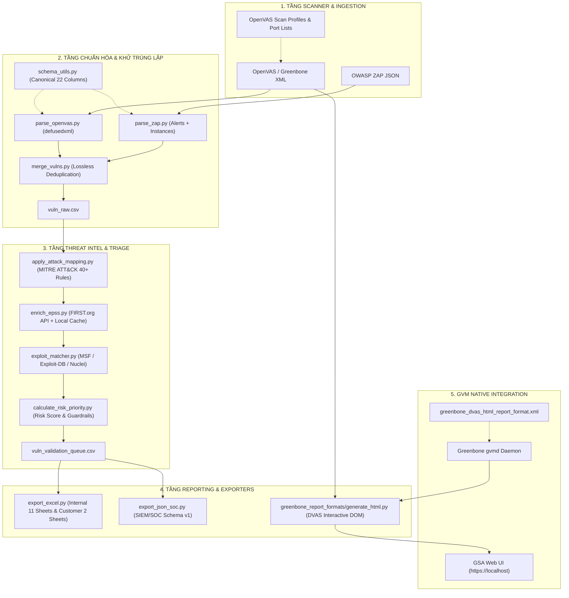

# 🛡️ Vulnerability Assessment & Threat Intelligence Pipeline (VA Pipeline)
## 📚 Tài Liệu Kỹ Thuật & Sổ Tay Vận Hành Toàn Diện (System Architecture & Master Guide)


Hệ thống **Pipeline Tự động hóa Đánh giá Lỗ hổng Bảo mật, Làm giàu Tình báo Mối đe dọa (Threat Intelligence), Đánh giá Rủi ro & Tương quan Khai thác Tự động** và **Xuất Báo cáo Đa định dạng Doanh nghiệp (Excel 11 Sheets, SOC/SIEM JSON v1, DVAS Interactive HTML cho Greenbone GVM)**.

---

## 📑 Mục Lục Điều Hướng

- [1. Tổng Quan Kiến Trúc & Sơ Đồ Luồng Dữ Liệu](#1-tổng-quan-kiến-trúc--sơ-đồ-luồng-dữ-liệu)
- [2. Cấu Trúc Toàn Diện Thư Mục Dự Án](#2-cấu-trúc-toàn-diện-thư-mục-dự-án)
- [3. Yêu Cầu Hệ Thống & Cài Đặt Hạ Tầng](#3-yêu-cầu-hệ-thống--cài-đặt-hạ-tầng)
- [4. Sổ Tay Vận Hành Pipeline (Operational Quickstart)](#4-sổ-tay-vận-hành-pipeline-operational-quickstart)
  - [4.1. Khởi chạy Giao diện Menu Tương tác](#41-khởi-chạy-giao-diện-menu-tương-tác)
  - [4.2. Chế độ CLI Tự Động (Non-interactive / Phục vụ CI-CD)](#42-chế-độ-cli-tự-động-non-interactive--phục-vụ-ci-cd)
  - [4.3. Luồng Tự Động Hóa Threat Intelligence & Triage Gate (Zero-AI)](#43-luồng-tự-động-hóa-threat-intelligence--triage-gate-zero-ai)
  - [4.4. Xem Bảng Thống Kê Nhanh (Show Stats)](#44-xem-bảng-thống-kê-nhanh-show-stats)
- [5. Động Cơ Khử Trùng Lặp Chuẩn Xác & Bảo Toàn CVE (Lossless Deduplication)](#5-động-cơ-khử-trùng-lặp-chuẩn-xác--bảo-toàn-cve-lossless-deduplication)
- [6. Phân Hệ Báo Cáo HTML "DVAS" Cho Greenbone GVM (GSA Web UI & CLI)](#6-phân-hệ-báo-cáo-html-dvas-cho-greenbone-gvm-gsa-web-ui--cli)
  - [6.1. Nhận diện thương hiệu & Kiến trúc Template](#61-nhận-diện-thương-hiệu--kiến-trúc-template)
  - [6.2. Cách 1: Kích hoạt tự động 1-Click qua CLI Script (Khuyên dùng)](#62-cách-1-kích-hoạt-tự-động-1-click-qua-cli-script-khuyên-dùng)
  - [6.3. Cách 2: Import thủ công qua GSA Web UI (`https://localhost/report-formats`)](#63-cách-2-import-thủ-công-qua-gsa-web-ui-httpslocalhostreport-formats)
  - [6.4. Cách 3: Tải báo cáo trực tiếp từ Greenbone GSA Web](#64-cách-3-tải-báo-cáo-trực-tiếp-từ-greenbone-gsa-web)
  - [6.5. Cách 4: Xuất báo cáo HTML độc lập không cần Greenbone](#65-cách-4-xuất-báo-cáo-html-độc-lập-không-cần-greenbone)
  - [6.6. Phòng chống Stored XSS & An toàn trong Mạng Cô lập](#66-phòng-chống-stored-xss--an-toàn-trong-mạng-cô-lập)
- [7. Hệ Thống Kiểm Thử Tự Động Hồi Quy (36 Automated Tests)](#7-hệ-thống-kiểm-thử-tự-động-hồi-quy-36-automated-tests)
- [8. Xử Lý Sự Cố & Câu Hỏi Thường Gặp (Troubleshooting & FAQ)](#8-xử-lý-sự-cố--câu-hỏi-thường-gặp-troubleshooting--faq)
- [9. Danh Mục Tài Liệu Kỹ Thuật Liên Quan](#9-danh-mục-tài-liệu-kỹ-thuật-liên-quan)

---

## 1. Tổng Quan Kiến Trúc & Sơ Đồ Luồng Dữ Liệu

Pipeline hoạt động theo mô hình các phân tầng xử lý tự động, độc lập và khép kín. Dữ liệu quét ban đầu được chuẩn hóa sang lược đồ 22 cột kinh điển (Canonical Schema), lọc nhiễu qua Triage Gate, làm giàu thông tin tình báo mối đe dọa (MITRE ATT&CK, EPSS, Exploit-DB, Metasploit, Nuclei), tự động tính toán ma trận rủi ro và thứ tự ưu tiên (P1-P5), và kết xuất ra các định dạng báo cáo phục vụ đa đối tượng (SOC/SIEM, Ban Giám Đốc, Đội ngũ Kỹ thuật và Khách hàng):



---

## 2. Cấu Trúc Toàn Diện Thư Mục Dự Án

```text
tool-scan-pipeline-security/
├── README.md                                # Trang chủ tài liệu dự án
├── compose.yml                              # Docker stack Greenbone Community 24.10 (14 containers)
├── setup.sh                                 # Script tự động cài đặt môi trường và công cụ OS
├── requirements.txt                         # Danh mục thư viện Python chuẩn
├── venv/                                    # Môi trường ảo Python độc lập (Python 3.12/3.10+)
│
├── greenbone_report_formats/                # PHÂN HỆ TEMPLATE BÁO CÁO HTML DVAS CHO GREENBONE
│   ├── greenbone_dvas_html_report_format.xml # Gói XML đóng gói chuẩn GMP để import qua GSA Web UI
│   ├── generate_html.py                     # Động cơ kết xuất HTML tương tác chuẩn DVAS (Zero dependencies)
│   ├── generate                             # Shell script entrypoint thực thi chuẩn của gvmd (chmod 0755)
│   ├── report_format.xml                    # Metadata định nghĩa định dạng báo cáo (UUID: d7a1249b-...)
│   ├── package_plugin.py                    # Script tự động mã hóa Base64 và đóng gói ra file XML GMP
│   └── README.md                            # Hướng dẫn chi tiết phân hệ Greenbone DVAS HTML Report
│
├── scripts/                                 # CỤM SCRIPTS XỬ LÝ TRUNG TÂM CỦA PIPELINE
│   ├── run_pipeline.py                      # Orchestrator chính điều phối các phân tầng pipeline
│   ├── runtime_context.py                   # Quản lý đường dẫn động theo từng run (VA_RUN_DIR)
│   ├── schema_utils.py                      # Định nghĩa 22 cột Canonical Schema & Redaction Engine
│   ├── parse_openvas.py                     # Parser XML OpenVAS/Greenbone an toàn (defusedxml)
│   ├── parse_zap.py                         # Parser JSON OWASP ZAP phân rã 2 tầng (Alert + Instances)
│   ├── merge_vulns.py                       # Động cơ khử trùng lặp không mất mát CVE (Lossless Deduplication)
│   ├── apply_attack_mapping.py              # Rule engine gán nhãn MITRE ATT&CK (40+ quy tắc)
│   ├── enrich_epss.py                       # Client tra cứu FIRST.org EPSS + Local Cache (.epss_cache.json)
│   ├── exploit_matcher.py                   # Tra cứu Metasploit, Exploit-DB, Nuclei theo ngữ cảnh
│   ├── calculate_risk_priority.py           # Tính toán Risk Score 0-100 & Khóa trần Guardrails
│   ├── export_excel.py                      # Xuất Excel nội bộ (11 sheets) & khách hàng (2 sheets)
│   ├── export_json_soc.py                   # Xuất sự kiện chuẩn SOC/SIEM Schema v1
│   ├── import_greenbone_report_format.py    # Script cài đặt & kích hoạt 1-Click DVAS HTML vào GVM
│   ├── generate_html_report.py              # CLI xuất báo cáo HTML DVAS độc lập từ file scan XML
│   ├── refresh_queue_risk.py                # Cập nhật lại điểm rủi ro khi có thay đổi
│   ├── show_stats.py                        # Xem nhanh bảng thống kê số liệu kết quả quét
│   ├── verify_setup.py                      # Kiểm tra tính sẵn sàng của công cụ và hệ điều hành
│   └── test_portability.py                  # Kiểm tra tính di động và liên kết thư mục dự án
│
├── OpenVas-config/                          # CẤU HÌNH QUÉT OPENVAS / GREENBONE
│   ├── scan-configs/                        # 4 Profile XML: Applications, Network, Security, Servers
│   └── port-lists/                          # 5 Port Lists XML & Range chuẩn hóa
│
├── config/                                  # Cấu hình phạm vi quét mục tiêu (Scope - Tùy chọn)
│   └── scope.example.yml                    # Mẫu khai báo IP/CIDR cho phép (Tùy chọn tham khảo cho Enterprise)
│
├── mapping/                                 # Bản đồ ánh xạ MITRE ATT&CK
│   └── attack_mapping_rules.yml             # 40+ rules ánh xạ từ khóa lỗ hổng sang Technique/Tactic
│
├── docs/                                    # TÀI LIỆU VẬN HÀNH & MÔ HÌNH BẢO MẬT
│   ├── README.md                            # [Tài liệu hiện tại] Master Documentation
│   ├── OPERATIONS.md                        # Sổ tay vận hành theo ca trực (Runbook)
│   ├── SECURITY_MODEL.md                    # Mô hình ranh giới an toàn trên Production
│   └── RUN_LOG_TEMPLATE.md                  # Mẫu nhật ký bàn giao ca trực
│
├── tests/                                   # HỆ THỐNG KIỂM THỬ TỰ ĐỘNG (36 TESTS)
│   ├── test_pipeline_regression.py          # 23 bài test hồi quy logic pipeline, threat intel & tool gating
│   ├── test_openvas_configs.py              # 6 bài test tính toàn vẹn cấu hình Greenbone XML
│   ├── test_html_report_format.py           # 7 bài test chuẩn hóa báo cáo HTML DVAS & chống XSS
│   └── fixtures/                            # Dữ liệu mẫu kiểm thử tự động độc lập
│       └── sample_openvas_report.xml        # Fixture XML OpenVAS chuẩn phục vụ unit tests
│
└── runs/                                    # Thư mục lưu trữ Artifact theo từng lần chạy (run_YYYYMMDD_HHMMSS)
    └── .gitkeep                             # Duy trì cấu trúc thư mục rỗng cho môi trường mới
```

---

## 3. Yêu Cầu Hệ Thống & Cài Đặt Hạ Tầng

### 3.1. Yêu cầu hệ thống
* **Hệ điều hành:** Linux (Khuyến nghị Ubuntu 22.04 LTS / 24.04 LTS).
* **Phần cứng:** Tối thiểu 8 GB RAM (Khuyến nghị 16 GB RAM và 4 CPU cores nếu chạy trọn bộ Greenbone Docker stack).
* **Python:** 3.10 trở lên.
* **Docker & Docker Compose:** Phiên bản Compose v2 trở lên, người dùng hiện tại có quyền thực thi Docker không cần `sudo`.

### 3.2. Cài đặt tự động trong 1 bước
Chạy script cài đặt môi trường tại thư mục gốc:
```bash
chmod +x setup.sh
./setup.sh
```
Script sẽ tự động thực hiện quy trình 7 bước chuẩn hóa:
1. **[1/7]** Cập nhật hệ thống, cài đặt thư viện biên dịch OS và Docker Engine chính thức từ Docker APT repo.
2. **[2/7]** Tạo môi trường ảo Python `./venv` và cài đặt các gói phụ thuộc từ `requirements.txt`.
3. **[3/7]** Tải Nuclei binary mới nhất từ ProjectDiscovery và cập nhật bộ Nuclei templates (`nuclei -ut`).
4. **[4/7]** Tải SearchSploit (Exploit-DB) từ GitLab và cập nhật cơ sở dữ liệu (`searchsploit -u`).
5. **[5/7]** Cài đặt Metasploit Framework qua script cài đặt chính thức của Rapid7.
6. **[6/7]** Khởi tạo cấu trúc thư mục chạy động (`runs/` theo phiên quét, `data/` tương thích ngược, `scripts/`, `mapping/`, `config/`).
7. **[7/7]** Cập nhật Nmap NSE scripts database, tải trước Docker images cho OWASP ZAP và Greenbone OpenVAS.

### 3.3. Kiểm tra tính sẵn sàng của môi trường
```bash
./venv/bin/python3 scripts/verify_setup.py
./venv/bin/python3 scripts/test_portability.py
```
Nếu toàn bộ mục kiểm tra hiển thị màu xanh (`OK` / `PASS`), hệ thống đã hoàn toàn sẵn sàng.

---

## 4. Sổ Tay Vận Hành Pipeline (Operational Quickstart)

### 4.1. Khởi chạy Giao diện Menu Tương tác
Chạy lệnh trực tiếp từ terminal:
```bash
./venv/bin/python3 scripts/run_pipeline.py
```
Menu tương tác sẽ hướng dẫn bạn:
```text
================================================================
   Vulnerability Assessment & Threat Intelligence Pipeline
================================================================
1. Start Scan        (Chạy quét mới bằng OpenVAS và OWASP ZAP)
2. Process Only      (Xử lý lại dữ liệu từ kết quả quét thô có sẵn)
3. Exit
```

### 4.2. Chế độ CLI Tự Động (Non-interactive / Phục vụ CI-CD)
Xử lý dữ liệu quét thô không cần can thiệp bàn phím:
```bash
./venv/bin/python3 scripts/run_pipeline.py \
  --non-interactive \
  --openvas-xml runs/run_20260908_104947/raw/report-f336654e-dd19-4792-b434-546f54b88f09.xml \
  --output-dir runs/run_custom_output
```

### 4.3. Luồng Tự Động Hóa Threat Intelligence & Triage Gate (Zero-AI)
Pipeline vận hành hoàn toàn tự động, độc lập (100% non-blocking, zero external AI prompts):
1. **Triage Gate (Lọc nhiễu thông minh):** Tự động phân loại ngữ cảnh và gắn nhãn `IGNORED_LOW_RISK` cho các phát hiện mức Low/Info không chứa từ khóa nhạy cảm (`password`, `token`, `credential`, `private key`, `backup`, `leak`, `disclosure`, `cve-`, `cwe-200`). Trạng thái này được bảo toàn nguyên vẹn từ tầng chuẩn hóa dữ liệu đến các báo cáo cuối.
2. **Exploit Intelligence Matching:** Tự động tra cứu mã CVE đối chiếu với Exploit-DB, Metasploit modules và Nuclei templates qua [`scripts/exploit_matcher.py`](scripts/exploit_matcher.py) kèm phân tích ngữ cảnh (Context Review), xác định trạng thái khai thác công khai (`PUBLIC_EXPLOIT_AVAILABLE`, `EXPLOIT_TEMPLATE_AVAILABLE`).
3. **Đánh giá Rủi ro Đa chiều (Risk Score Engine):** Kết hợp trọng số Severity + Điểm EPSS (tỷ lệ phần trăm bị khai thác trong 30 ngày) + Mức độ trưởng thành của mã khai thác (Exploit Maturity) để tự động tính điểm rủi ro (0-100) và gán nhãn ưu tiên P1 (Critical) tới P5 (Informational) qua [`scripts/calculate_risk_priority.py`](scripts/calculate_risk_priority.py).
4. **Tự Động Xuất Báo Cáo Đa Kênh:** Tự động kết xuất trọn bộ báo cáo kỹ thuật Excel (11 sheets nội bộ, 2 sheets bàn giao khách hàng), sự kiện SOC/SIEM JSON Schema v1 và Báo cáo tương tác DVAS HTML Report (`dvas_security_report.html` cho cả Internal và Customer-safe khi có dữ liệu OpenVAS) mà không cần can thiệp bàn phím.

### 4.4. Xem Bảng Thống Kê Nhanh (Show Stats)
```bash
./venv/bin/python3 scripts/show_stats.py
```

---

## 5. Động Cơ Khử Trùng Lặp Chuẩn Xác & Bảo Toàn CVE (Lossless Deduplication)

Trong quá trình đối soát dữ liệu thực tế, các thuật toán khử trùng lặp truyền thống thường làm mất mát các CVE đặc thù do các cảnh báo cùng gói phần mềm chia sẻ tên tương đồng (ví dụ: `PHP 8.1.x < 8.1.29` và `PHP 8.2.x < 8.2.20`). Động cơ trong [`scripts/merge_vulns.py`](scripts/merge_vulns.py) đã được nâng cấp toàn diện với 3 cơ chế bảo vệ nghiêm ngặt:

### 5.1. Cơ chế Chống Nhập Nhằng Lớp Lỗ Hổng (`_are_incompatible_vuln_types`)
Ngăn chặn tuyệt đối việc gộp hai phát hiện trên cùng máy chủ nếu chúng đại diện cho hai lớp tấn công hoàn toàn khác nhau (ví dụ: `SSRF` vs `Authentication Bypass`, hoặc `SQL Injection` vs `Open Redirect`), ngay cả khi tỷ lệ so khớp chuỗi ký tự tên gọi đạt mức cao.

### 5.2. Cơ chế Bảo Toàn CVE Rời Rạc (`Disjoint CVE Preservation Guard`)
Nếu hai bản ghi tiềm năng trên cùng một cổng đều chứa danh sách CVE không rỗng và tập hợp CVE của chúng **hoàn toàn rời rạc** (`cves.isdisjoint(kept_cves)`), thuật toán khử trùng lặp bằng tên mờ (fuzzy deduplication) sẽ **bị vô hiệu hóa hoàn toàn**. Cả hai bản ghi bắt buộc phải được giữ lại thành hai dòng độc lập trong pipeline.

### 5.3. Cơ chế Hợp Nhất Không Mất Mát (`_enrich_existing_finding`)
Khi hai máy quét (ví dụ: ZAP và OpenVAS) phát hiện cùng một lỗ hổng thực sự trên cùng endpoint:
* **Hợp nhất CVE & CWE:** Hợp nhất toàn diện các mã CVE và CWE thông qua phép hợp tập hợp (`set.union()`), không làm mất bất kỳ mã số nào.
* **Tổng hợp Chứng cứ & URLs:** Ghép nối bằng chứng quét và hợp nhất danh sách URL bị ảnh hưởng trong `affected_urls_json`.
* **Bảo tồn Điểm Cao Nhất:** Giữ lại điểm số CVSS lớn nhất và mức độ Severity nghiêm ngặt nhất.
* **Tăng số lượng phát hiện:** Tự động cộng dồn số lượng instance (`instance_count`).

> **Kết quả kiểm nghiệm trên run thực tế (`run_20260908_104947`):**
> * Số CVE trước khi tối ưu: 49 CVEs (Mất 25 CVEs, bao gồm cả lỗ hổng RCE nghiêm trọng `CVE-2024-4577`).
> * Số CVE sau khi tối ưu: **74/74 CVEs được bảo toàn 100%** xuyên suốt từ XML thô, CSV hợp nhất, Queue tính điểm, Excel Báo cáo cho tới JSON SOC.

---

## 6. Phân Hệ Báo Cáo HTML "DVAS" Cho Greenbone GVM (GSA Web UI & CLI)

Phân hệ báo cáo HTML mới được thiết kế riêng để đáp ứng tiêu chuẩn báo cáo an toàn thông tin doanh nghiệp, thay thế hoàn toàn giao diện mặc định của máy quét bằng nhận diện thương hiệu **DVAS**.

### 6.1. Nhận diện thương hiệu & Kiến trúc Template
* **Logo & Brand Badge:** Huy hiệu **DVAS** thiết kế chuẩn Vector/CSS Gradient (`#002B49` đến `#0072CE`), tiêu đề **DVAS Security Intelligence Platform**.
* **Xóa sạch 100% nhận diện Nessus/Tenable:** Không còn sót bất kỳ logo, watermark hay chuỗi ký tự bản quyền nào của Nessus/Tenable.
* **5 Thẻ Tổng Hợp Nguy Cơ:**
  * 🔴 **Critical:** `#91243E`
  * 🟠 **High:** `#DD4B50`
  * 🟡 **Medium:** `#F18C43`
  * 🟡 **Low:** `#F8C851`
  * 🔵 **Info / Log:** `#67ACE1`
* **Mục Lục Máy Chủ (Host Table of Contents):** Liệt kê chi tiết từng IP, số lượng lỗ hổng theo từng cấp độ và đường link neo trực tiếp tới phần chi tiết.
* **Thẻ Lỗ Hổng Mở Rộng/Thu Gọn (Collapsible Finding Cards):** Hỗ trợ click từng thẻ (`toggleVuln`) hoặc nút bấm toàn cục **Expand All / Collapse All**.
* **Tra cứu Tức thì NVD & MITRE:** Mã CVE tự động gắn thẻ liên kết đến `https://nvd.nist.gov/vuln/detail/CVE-...`, mã CWE liên kết tới `cwe.mitre.org`.
* **Chi Tiết Bằng Chứng Quét:** Bảng thông tin OID Plugin, họ lỗ hổng, phần mềm ảnh hưởng và khung **Scanner Output / Evidence** chứa chính xác bằng chứng kỹ thuật.

---

### 6.2. Cách 1: Kích hoạt tự động 1-Click qua CLI Script (Khuyên dùng)
Đây là cách nhanh nhất và an toàn nhất. Script sẽ tự động trao đổi với daemon GVM qua socket GMP, thiết lập thư mục và cấp quyền tin cậy trong cơ sở dữ liệu:
```bash
python3 scripts/import_greenbone_report_format.py
```
**Quy trình script tự động thực hiện:**
1. Đọc gói XML `greenbone_report_formats/greenbone_dvas_html_report_format.xml`.
2. Gửi lệnh GMP `<create_report_format>` tới `gvmd` qua `gvm-cli socket`.
3. Đồng bộ các file mã nguồn (`generate`, `generate_html.py`, `report_format.xml`) vào thư mục `/var/lib/gvm/gvmd/report_formats/<admin-uuid>/<format-uuid>/` trong container `gvmd`.
4. Cập nhật bảng `report_formats` trong PostgreSQL sang trạng thái `trust = 1, flags = 1` (Active: Yes, Trust: Yes).

---

### 6.3. Cách 2: Import thủ công qua GSA Web UI (`https://localhost/report-formats`)
Nếu bạn muốn thao tác trực tiếp trên giao diện trình duyệt:
1. Mở trình duyệt và truy cập: **`https://localhost/report-formats`** (Menu điều hướng: **Configuration** $\rightarrow$ **Report Formats**).
2. Nhấn vào biểu tượng **Upload Report Format** (mũi tên tải lên màu xanh ở thanh công cụ góc trên bên trái bảng).
3. Bấm **Browse...** và chọn tệp tin:
   ```text
   greenbone_report_formats/greenbone_dvas_html_report_format.xml
   ```
4. Nhấn **Import**. Định dạng **DVAS HTML Report** sẽ xuất hiện ngay trong danh sách Report Formats.
> [!NOTE]
> Khi import qua Web UI, theo chính sách bảo mật của Greenbone GOS, định dạng mới tải lên sẽ có trạng thái `Trust: Unknown` (trust=3) để chờ Admin phê duyệt. Bạn chỉ cần chạy lệnh `python3 scripts/import_greenbone_report_format.py` để script tự động kích hoạt quyền tin cậy (`Trust: Yes`).

---

### 6.4. Cách 3: Tải báo cáo trực tiếp từ Greenbone GSA Web
Sau khi định dạng đã được cài đặt:
1. Truy cập **Scans** $\rightarrow$ **Reports**.
2. Nhấp chuột vào dòng kết quả quét cần xem.
3. Ở góc trên bên phải trang chi tiết, nhấn vào nút **Download Report** (biểu tượng tải xuống).
4. Trong menu chọn định dạng (Report Format), chọn **DVAS HTML Report**.
5. Bấm **OK**. Trình duyệt sẽ tải về tệp tin HTML tương tác hoàn chỉnh mang thương hiệu DVAS.

---

### 6.5. Cách 4: Xuất báo cáo HTML độc lập không cần Greenbone
Nếu bạn muốn tạo nhanh báo cáo HTML từ một file XML kết quả quét lưu trên ổ cứng (ví dụ tích hợp vào CI/CD Pipeline):
```bash
python3 scripts/generate_html_report.py \
  runs/run_20260908_104947/raw/report-f336654e-dd19-4792-b434-546f54b88f09.xml \
  -o Bao_Cao_Bao_Mat_DVAS.html
```

---

### 6.6. Phòng chống Stored XSS & An toàn trong Mạng Cô lập
* **Miễn nhiễm Stored XSS:** Do kết quả quét mạng chứa các chuỗi ký tự thô từ mục tiêu (HTTP headers, banner dịch vụ, tham số bẩn), `generate_html.py` thực hiện lọc sạch 100% dữ liệu trước khi chèn vào DOM thông qua hàm chuẩn `html.escape(quote=True)`.
* **Hoàn toàn Offline-Safe:** Toàn bộ CSS, JavaScript, icon và font chữ được nhúng nội bộ (`inline`) 100%. Báo cáo **không thực hiện bất kỳ kết nối mạng HTTP/DNS nào ra ngoài**, bảo đảm tuân thủ nghiêm ngặt các quy định bảo mật trong Trung tâm Giám sát An ninh Mạng (SOC Cô lập / Air-gapped Network).

---

## 7. Hệ Thống Kiểm Thử Tự Động Hồi Quy (36 Automated Tests)

Hệ thống được bảo vệ bởi bộ kiểm thử tự động toàn diện gồm **36 bài test độc lập**, bảo đảm mọi thay đổi mã nguồn không gây hồi quy logic:

```bash
# Chạy toàn bộ 36 bài test tự động bằng môi trường ảo venv
./venv/bin/python3 -m unittest discover tests -v
```

### Phân Bổ 36 Test Cases:
1. **`tests/test_html_report_format.py` (7 tests):**
   * `test_openvas_xml_data_extraction_counts`: Xác minh trích xuất đủ 60 phát hiện, 74+ CVEs và 5 phân nhóm mức độ từ fixture độc lập.
   * `test_dvas_branding_and_zero_nessus_residue`: Xác minh sạch 100% nhận diện Nessus/Tenable, chuẩn hóa 5 vị trí DVAS.
   * `test_cve_2024_4577_and_critical_vulns_retained`: Xác minh lưu giữ và gắn link NVD cho `CVE-2024-4577`.
   * `test_stored_xss_prevention`: Xác minh ngăn chặn mã độc JavaScript chèn trong scanner output qua `html.escape(quote=True)`.
   * `test_is_safe_url_validation`: Xác minh kiểm duyệt nghiêm ngặt URL scheme (chỉ chấp nhận HTTP/HTTPS hợp lệ, chặn đứng `javascript:`, `data:`, `vbscript:`).
   * `test_multi_target_dynamic_rendering`: Kiểm tra khả năng sinh giao diện HTML tương tác đa mục tiêu (Multi-Target Dynamic DOM).
   * `test_package_xml_and_base64_integrity`: Xác minh tính toàn vẹn của gói import XML và Base64 GMP.
2. **`tests/test_openvas_configs.py` (6 tests):**
   * Kiểm tra 4 profile scan XML, 5 port lists, đảm bảo 0 hardcoded credentials và loại trừ toàn bộ plugin DoS/Brute-force.
3. **`tests/test_pipeline_regression.py` (23 tests):**
   * `test_run_threat_intel_phase_executes_automatically_without_ai_prompt`: Kiểm chứng toàn diện luồng Threat Intel chạy tự động 100%, không dừng chờ prompt, đối soát Exploit-DB/Metasploit, tính Risk Score, xuất đủ Excel đa sheet và SOC JSON v1 mà không tạo bất kỳ thư mục hay file AI nào.
   * `test_validate_scope_allows_target_when_scope_file_missing`: Xác thực `validate_scope` trả về hợp lệ (0 lỗi) khi không có file scope, hỗ trợ tối đa chuyên viên VA.
   * `test_validate_scope_allows_unscoped_via_flag_and_env`: Xác thực cờ `allow_unscoped_scan` hoặc biến môi trường `VA_ALLOW_UNSCOPED_SCAN`.
   * `test_zap_full_scan_selection_not_blocked_by_scope`: Xác thực ZAP Full Deep Scan kích hoạt ngay lập tức mà không bị cản trở bởi cờ scope.
   * `test_disallowed_tools_policy_and_checks`: Kiểm chứng việc loại trừ hoàn toàn các công cụ `sqlmap`, `nikto`, `wpscan`.
   * Kiểm tra khử trùng lặp không drop CWE, bảo toàn CVE rời rạc khi tên tương đồng, hợp nhất URL và đa CVE trên bản ghi trùng, parser severity Informational, tính toán điểm rủi ro & Guardrails, phát hiện loopback IP, bảo toàn trạng thái lọc nhiễu `IGNORED_LOW_RISK`.

---

## 8. Xử Lý Sự Cố & Câu Hỏi Thường Gặp (Troubleshooting & FAQ)

### Q1: Sau khi import template qua GSA Web UI, tại sao trạng thái hiển thị "Trust: Unknown"?
> **Trả lời:** Đây là cơ chế bảo vệ mặc định của Greenbone GOS: mọi report format do người dùng tải lên ban đầu đều mang quyền `trust = 3` (Unknown) để ngăn chạy mã lạ. Bạn chỉ cần chạy lệnh sau trên terminal host:
> ```bash
> python3 scripts/import_greenbone_report_format.py
> ```
> Script sẽ cập nhật database PostgreSQL của GVM sang trạng thái `trust = 1, flags = 1` (`Trust: Yes`, `Active: Yes`) ngay lập tức.

### Q2: Tại sao kết quả quét OpenVAS hiển thị 60 findings nhưng trước đây Excel chỉ có 35-40 findings?
> **Trả lời:** Trước đây, hàm `difflib.SequenceMatcher` so sánh tên với ngưỡng 0.8 đã vô tình gộp các bản ghi có tên giống nhau (như các phiên bản PHP khác nhau) và loại bỏ dòng trùng mà không gộp CVE. Vấn đề này đã được khắc phục hoàn toàn trong [`scripts/merge_vulns.py`](scripts/merge_vulns.py) nhờ cơ chế **Disjoint CVE Preservation Guard**. Hiện tại 100% (60/60 findings và 74/74 CVEs) đều được bảo toàn trọn vẹn.

### Q3: Báo cáo HTML DVAS có cần kết nối Internet để hiển thị icon hay biểu đồ không?
> **Trả lời:** Hoàn toàn không. Toàn bộ mã định dạng CSS, font chữ, mã màu và JavaScript đều được nhúng trực tiếp trong file HTML (dung lượng khoảng ~260 KB). Báo cáo hiển thị mượt mà trên mọi máy tính trong mạng nội bộ cô lập (Air-gapped SOC).

---

## 9. Danh Mục Tài Liệu Kỹ Thuật Liên Quan

* 📖 **[Sổ Tay Vận Hành Chi Tiết (`docs/OPERATIONS.md`)](docs/OPERATIONS.md):** Quy trình trực ca, kiểm soát thư mục `runs/` và checkpoint bàn giao.
* 🛡️ **[Mô Hình An Toàn Production (`docs/SECURITY_MODEL.md`)](docs/SECURITY_MODEL.md):** Ranh giới an toàn tuyệt đối và quy định cách ly mạng.
* 📝 **[Tài Liệu Greenbone DVAS HTML Report Plugin (`greenbone_report_formats/README.md`)](greenbone_report_formats/README.md):** Hướng dẫn cài đặt, kích hoạt 1-click và thẩm định chất lượng báo cáo trực tiếp từ GVM daemon.
