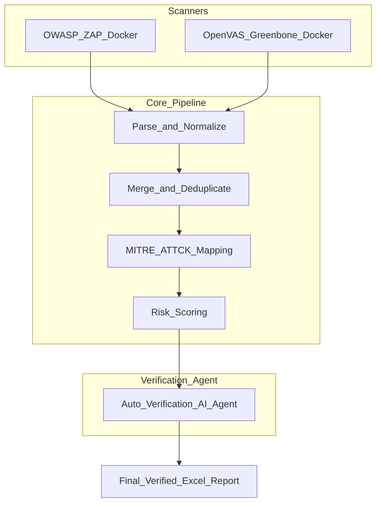

# 🔐 Task 4: Automated Vulnerability Management Pipeline (V10 Ultimate)

> “From Detection to Verification: A Closed‑Loop Security Pipeline”
> Hệ thống tự động hóa quy trình quản lý lỗ hổng bảo mật, hợp nhất dữ liệu scan đa nguồn, chuẩn hoá, map ATT&CK, scoring và tự động xác thực với agent AI.

---

## 🧠 1. Giới thiệu (Overview)

Dự án này là một **Vulnerability Management Pipeline** tích hợp:
- **Dynamic Application Security Testing (DAST)** bằng **OWASP ZAP**
- **Infrastructure/Host Scanning** bằng **OpenVAS / Greenbone**
- Chuẩn hoá đầu ra, merge kết quả, ánh xạ vào **MITRE ATT&CK**
- **Smart Risk Scoring** & lọc **False Positive** bằng **Auto‑Verification Agent (AI)**

Mục tiêu: chuyển các kết quả scan rời rạc thành dữ liệu có thể phân tích, ưu tiên và hành động.

---

## ⚙️ 2. Tính năng chính (Key Features)

* 🎯 **Hybrid Scanning**: ZAP + OpenVAS
* 📊 **Normalization & Merge Pipeline**
* 🧭 **MITRE ATT&CK Mapping**
* 📈 **Smart Risk Scoring** (P1–P4)
* 🤖 **Auto‑Verification Agent (AI Agent)** — kiểm chứng tìm thấy bằng probe thực tế
* 📄 **Professional Report Export** (Excel với dashboard trực quan)
* 🛠️ Modular, extensible CLI + Python scripts

---

## 🏗️ 3. Kiến trúc hệ thống (Architecture)



---

## 🗂️ 4. Cấu trúc thư mục

```
/
├─ data/
│   ├─ raw/           # Reports gốc (JSON/XML)
│   ├─ normalized/    # CSV đã chuẩn hoá
│   └─ output/        # Kết quả merge + final reports
├─ scripts/
│   ├─ parse_zap.py
│   ├─ parse_openvas.py
│   ├─ merge_vulns.py
│   └─ ai_verifier.py
├─ mapping/
│   ├─ attack_mapping_rules.yml
│   └─ risk_weights.yml
├─ docs/
├─ requirements.txt
└─ README.md
```

---

## 🛠️ 5. Cài đặt & môi trường

### 📦 Yêu cầu
- Docker & Docker Compose
- Python 3.10+
- RAM ≥ 8GB
- Quyền scan hợp pháp trên target

---

## 🧪 6. Triển khai OWASP ZAP (DAST)

**Khởi chạy target mẫu (ví dụ DVWA):**

```bash
docker run -d -p 8080:80 --name dvwa vulnerables/web-dvwa
```

**Chạy ZAP scan (baseline):**

```bash
docker run --rm -v $(pwd)/data/raw:/zap/wrk/:rw \
  ghcr.io/zaproxy/zaproxy:stable \
  zap-baseline.py \
  -t http://172.17.0.1:8080 \
  -J zap_report.json \
  -r zap_report.html
```

- Lưu `zap_report.json` vào `data/raw/`
- JSON dùng để parse/normalize

---

## 🧪 7. Triển khai OpenVAS (Greenbone)

**Start bằng Docker Compose:**

```bash
export DOWNLOAD_DIR=$HOME/greenbone-community-container
mkdir -p $DOWNLOAD_DIR && cd $DOWNLOAD_DIR
curl -L https://greenbone.github.io/docs/latest/_static/docker-compose.yml -o docker-compose.yml
docker compose pull
docker compose up -d
```

**Kiểm tra feed sync (bắt buộc):**

```bash
docker compose logs gvmd | grep -Ei "SCAP|CERT|NVT|Current"
```

**Đổi mật khẩu admin:**

```bash
docker compose exec -u gvmd gvmd gvmd --user=admin --new-password="YourPass!"
```

---

## 📤 8. Export & Normalize Reports

### OpenVAS → XML
- Qua UI: Scans → Reports → Export XML
- Save: `data/raw/openvas_report.xml`

**Parse XML → CSV:**

```bash
python3 scripts/parse_openvas.py \
  data/raw/openvas_report.xml \
  data/normalized/openvas_findings.csv
```

### ZAP → JSON

```bash
python3 scripts/parse_zap.py \
  data/raw/zap_report.json \
  data/normalized/zap_findings.csv
```

---

## 🔗 9. Merge & Scoring

**Merge CSVs:**

```bash
python3 scripts/merge_vulns.py
```

**Output:**
```
data/output/vuln_raw.csv
```

Fields include: scanner, asset, finding, severity, CVE/CWE, ATT&CK IDs, risk score.

---

## 🤖 10. AI Verification Agent

Auto‑verify vulnerabilities by:
- Probing the target (protocols, tools available)
- Active checks to reduce false positives
- Update final report to `data/output/verified_report.xlsx`

---

## 📈 11. Báo cáo & Dashboard

Kết quả cuối cùng:
- **Excel Report** với bảng ưu tiên P1–P4
- Biểu đồ ATT&CK heatmap
- Chi tiết từng lỗ hổng + bằng chứng xác thực

---

## 💡 12. Contributing

Bạn có thể đóng góp:
- rule mapping mới (mapping/*.yml)
- script parser
- City score refinements
- thêm scanner khác (Snyk, Trivy, Semgrep)

---

## 📝 13. License

Project sử dụng **MIT License** (hoặc chọn giấy phép phù hợp cho team).

---

## 📌 14. Lời kết

Đây là một pipeline hoàn chỉnh từ **scan → normalize → merge → map ATT&CK → risk score → verified report**, hữu ích để demo, học tập hoặc triển khai nội bộ DevSecOps.

---

*Author By Tc3S.*

