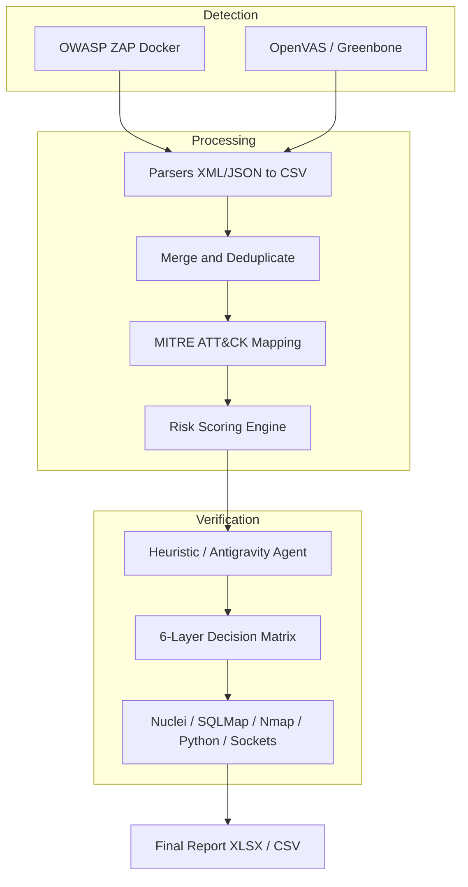

# 🛡️ Task 4 — Automated Vulnerability Management Pipeline

**From Detection to Verification: A Closed-Loop Security Pipeline**

_Hệ thống quản lý lỗ hổng bảo mật tự động: hợp nhất dữ liệu scan (ZAP / OpenVAS), chuẩn hoá, ánh xạ MITRE ATT&CK, tính điểm rủi ro và tự động xác thực bằng Heuristic/Antigravity AI Agent._

---

## 1. Tổng quan (Overview)

Mục tiêu: giảm **Alert Fatigue** trong DevSecOps bằng một pipeline khép kín — từ phát hiện (detection), làm giàu (enrichment), xếp hạng (risk scoring) đến **xác thực tự động** (active verification) trước khi tạo báo cáo cho team.

Quy trình chính:

1. **Detection** — OWASP ZAP (Web DAST) + OpenVAS / Greenbone (Infra/OS).
2. **Parsing & Normalization** — XML/JSON → CSV chuẩn chung.
3. **Enrichment** — ánh xạ CWE/CVE → MITRE ATT&CK, thêm ngữ cảnh (host, service, app).
4. **Risk Scoring** — engine gán Priority (P1…P4) dựa trên trọng số cấu hình.
5. **Verification** — Heuristic / Antigravity Agent chạy ma trận quyết định nhiều lớp, ghi lại evidence.
6. **Reporting** — Excel + CSV + dashboard (tùy triển khai).

---

## 2. Tính năng chính (Key Features)

- **Hybrid Scanning**: nhận input ZAP JSON và OpenVAS XML.
- **Unified Data Model**: chuẩn hóa mọi report về CSV trung gian để dễ xử lý/gộp.
- **MITRE ATT&CK Mapping**: ánh xạ tự động tactic/technique dựa trên CWE/CVE/rule.
- **Smart Risk Scoring**: configurable weights → Priority P1 (Critical) → P4 (Info).
- **Heuristic Auditor / Antigravity Agent**:
  - Áp dụng **Ma trận quyết định 6 lớp (6-Layer Decision Matrix)** để xác thực lỗ hổng một cách có hệ thống.
  - **Layer 1 – Nuclei (Sniper):** Ưu tiên số một cho CVE và misconfiguration (tốc độ cao, chính xác).
  - **Layer 2 – SQLMap / WPScan:** Dành cho SQL Injection và CMS-specific vulnerabilities.
  - **Layer 3 – Native Python (Web Surgeon):** Xác thực logic web (headers, 403 bypass, traversal) bằng code Python do Agent sinh ra.
  - **Layer 4 – Nmap (Infra Engineer):** Kiểm tra hạ tầng, version, SSL/SSH bằng Nmap/NSE.
  - **Layer 5 – Protocol Adapter:** Phân tích dịch vụ đặc thù (Redis, Mongo, Memcached…) bằng socket Python.
  - **Layer 6 – Safety Net:** TCP connect check khi không lớp nào phù hợp.
  - Evidence-Based / Zero-Hallucination: chỉ xác nhận khi có output chứng thực.
- **Export**: `vuln_attack_report.xlsx`, `vuln_attack_enriched.csv`, `vuln_validation_queue.csv`.

---

## 3. Cơ chế hoạt động của Agent — Ma trận quyết định 6 lớp

Agent tuân thủ ma trận quyết định nhiều lớp nhằm đảm bảo tính chính xác, ưu tiên sử dụng công cụ chuyên dụng, và fallback an toàn khi công cụ không sẵn sàng.

**Layer 1 — The Sniper (Nuclei)**

Ưu tiên nếu template Nuclei khớp với CVE/misconfiguration → thực thi template để lấy evidence.

**Layer 2 — Heavy Artillery (SQLMap / WPScan)**

Dành cho SQLi, CMS-specific checks.

**Layer 3 — The Web Surgeon (Native Python)**

Xử lý logic web (custom payload, header manipulation, path traversal) bằng script Python do Agent sinh hoặc tận dụng module sẵn có.

**Layer 4 — Infra Engineer (Nmap / NSE)**

Xác thực lỗi hạ tầng (version/ssl/ssh/ports) bằng Nmap scripts để lấy banner/phiên bản.

**Layer 5 — Protocol Adapter (Dynamic Socket)**

Kết nối dịch vụ đặc thù (Redis, Memcached, Mongo...) bằng socket để lấy banner/đầu mối.

**Layer 6 — Safety Net (TCP Connect Check)**

Nếu mọi thứ không khớp, kiểm tra kết nối cơ bản (tcp connect) để xác định trạng thái dịch vụ.

**Trạng thái trả về của mỗi lớp**: `CONFIRMED_PRESENT`, `REPRODUCED`, `CHECKED_NO_EXPLOIT`, `NOT_REPRODUCED`, `ERROR`.
Agent chỉ xác nhận khi evidence thỏa điều kiện (pattern, response code, banner, dump, v.v.). Trạng thái được chuẩn hóa theo output của Agent (xem mục 8).

---

## 4. Kiến trúc (Architecture)



---

## 5. Cấu trúc thư mục (Project structure)

```
task4-attack-vuln-mgmt/
├── data/
│   ├── raw/                # input: openvas_report.xml, zap_report.json
│   ├── normalized/         # intermediate CSVs
│   └── output/             # vuln_attack_report.xlsx, vuln_validation_queue.csv
├── mapping/
│   ├── attack_mapping_rules.yml  # Luật mapping MITRE ATT&CK
│   └── risk_weights.yml          # Trọng số tính Risk
├── scripts/
│   ├── run_pipeline.py            # MASTER script: orchestrator + UI menu
│   ├── antigravity_agent_bridge.py# Agent core / scheduler
│   ├── verify_vulns.py            # [AUTO-GENERATED] scripts per vuln (Agent)
│   ├── parse_zap.py               # parser ZAP -> CSV
│   ├── parse_openvas.py           # parser OpenVAS -> CSV
│   ├── merge_vulns.py             # dedupe & merge
│   ├── apply_attack_mapping.py    # MITRE mapping
│   ├── calculate_risk_priority.py # Risk scoring
│   └── export_excel.py            # Export XLSX
├── requirements.txt
└── README.md
```

---

## 6. Yêu cầu & Cài đặt nhanh (Requirements & Quick start)

**Yêu cầu hệ thống**

- OS: Linux (Ubuntu / Kali) hoặc WSL2 trên Windows
- Python 3.10+
- Docker & Docker Compose (để chạy ZAP/OpenVAS container)
- Khuyến nghị: `nmap`, `nuclei`, `sqlmap`, `docker` trên host để Agent chạy đầy đủ năng lực

**Thiết lập môi trường Python**

```bash
# Tại thư mục project
python3 -m venv venv
source venv/bin/activate    # Linux/macOS
# venv\Scripts\activate   # Windows

pip install -r requirements.txt
```

**Gợi ý nội dung `requirements.txt`**

```
pandas
numpy
requests
xlsxwriter
pyyaml
lxml
openpyxl
```

**Chuẩn bị Scanner (Docker)**

- OpenVAS (Greenbone): tải `docker-compose.yml` chính thức của Greenbone, `docker compose up -d`, chờ feed sync.
- OWASP ZAP: `ghcr.io/zaproxy/zaproxy:stable` — dùng `zap-baseline.py` hoặc API để chạy scan.

Ví dụ chạy ZAP (container):

```bash
docker run --rm -v $(pwd)/data/raw:/zap/wrk/:rw \
  ghcr.io/zaproxy/zaproxy:stable zap-baseline.py \
  -t http://example.com \
  -r zap_report.html \
  -J zap_report.json
```

**Chạy pipeline**

```bash
python3 scripts/run_pipeline.py
```

Chế độ trong script:
- `Start Scan` — gọi Docker ZAP (scan mới) -> process -> verify
- `Process Only` — xử lý file report có sẵn (data/raw) -> verify
- `Verify Only` — chạy agent trên CSV normalized

---

## 7. Outputs & Trường dữ liệu quan trọng

Các file xuất tại `data/output/`:

- `vuln_attack_report.xlsx` — Báo cáo cuối cùng: Priority, MITRE ATT&CK, Agent Status, Evidence.
- `vuln_validation_queue.csv` — Hàng đợi xác thực chi tiết (mỗi lỗ hổng = 1 task của Agent).
- `vuln_attack_enriched.csv` — Dataset đã enrich, dùng cho SIEM / phân tích thêm.

Trường chính:
`id`, `host`, `port`, `service`, `cve`, `cwe`, `attack_tactic`, `attack_technique`, `priority` (P1–P4), `agent_status`, `evidence`, `timestamp`

---

## 8. Trạng thái xác thực (Agent status codes)

Các trạng thái dưới đây **khớp trực tiếp với output report của code**:

- `CONFIRMED_PRESENT` — Lỗ hổng/cấu hình được xác nhận tồn tại (evidence rõ ràng: banner, header, version, response).
- `REPRODUCED` — Đã tái hiện thành công kịch bản tấn công (ví dụ: SQLi payload thành công, bypass 403).
- `CHECKED_NO_EXPLOIT` — Đã kiểm tra kỹ, dịch vụ tồn tại nhưng không khai thác được.
- `NOT_REPRODUCED` — Không thể tái hiện điều kiện lỗi hoặc không kết nối được.
- `ERROR` — Tool lỗi hoặc exception; Agent ghi log nhưng **pipeline không dừng**.

---

## 9. Mapping MITRE & Risk Scoring

- `mapping/attack_mapping_rules.yml` chứa luật ánh xạ (CWE → MITRE ATT&CK).
- `mapping/risk_weights.yml` cho trọng số: CVSS, asset_value, exploitability, public_exploit_exists, business_impact.

Risk engine tính điểm tổng hợp và gán Priority:
- P1: score ≥ `threshold_critical`
- P2: score ≥ `threshold_high`
- P3: medium
- P4: info

(Các threshold được cấu hình trong `mapping/risk_weights.yml` hoặc settings của pipeline.)

---

## 10. Best practices & Lưu ý vận hành

- **Chỉ quét hệ thống được phép** — tuân thủ pháp luật & chính sách công ty.
- **OpenVAS feed sync** có thể mất thời gian; giữ Docker volumes để tiết kiệm thời gian sync.
- Thử nghiệm Agent trên môi trường lab trước khi bật full automation trên production.
- Giới hạn tốc độ/parallelism của Agent để tránh làm gián đoạn dịch vụ mục tiêu.
- Ghi log chi tiết, enable audit trails cho mọi action Agent thực hiện.

---

## 11. Troubleshooting — Vấn đề thường gặp

- **OpenVAS thiếu dữ liệu/không hiện lỗi chi tiết** → kiểm tra logs `gvmd` & chờ SCAP/CERT sync.
- **Agent không tìm thấy tool (nuclei/sqlmap)** → Agent sẽ fallback sang Python native; tuy nhiên chức năng có thể chậm hơn.
- **Docker permission errors** → chạy Docker với user có quyền hoặc thêm `sudo`.
- **Pipeline crash khi xử lý file lớn** → bật chế độ streaming/yield, chunk processing trong parser.

---


## 12. License & Credits
**Author:** Tc3s

**License:** MIT

---

