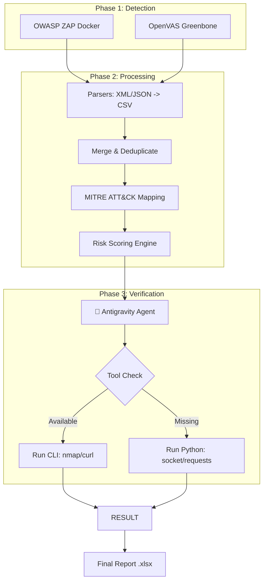

# 🛡️ Task 4: Automated Vulnerability Management Pipeline

> **"From Detection to Verification: A Closed-Loop Security Pipeline"**
>
> *Hệ thống quản lý lỗ hổng bảo mật tự động: Hợp nhất dữ liệu scan đa nguồn, chuẩn hoá, map MITRE ATT&CK, tính điểm rủi ro và tự động xác thực bằng AI Agent.*

---

## 🧠 1. Giới thiệu (Overview)

Dự án này giải quyết bài toán **"Quá tải cảnh báo"** (Alert Fatigue) trong DevSecOps bằng cách xây dựng một **Vulnerability Management Pipeline** hoàn chỉnh.

Thay vì chỉ đưa ra danh sách lỗ hổng thô, hệ thống thực hiện quy trình khép kín gồm:

1. **Quét đa lớp** — Kết hợp DAST (ZAP) cho Web và Infrastructure Scan (OpenVAS) cho mạng/OS.
2. **Làm giàu dữ liệu** — Ánh xạ lỗ hổng vào khung **MITRE ATT&CK**.
3. **Xếp hạng thông minh** — Tính điểm rủi ro (Risk Scoring) dựa trên ngữ cảnh và độ nghiêm trọng.
4. **Tự động xác thực (Antigravity Agent)** — Sử dụng Agent thông minh để kiểm tra lại lỗ hổng (Active Verification) mà không cần API Key trả phí, giúp loại bỏ False Positives.

---

## ⚙️ 2. Tính năng chính (Key Features)

- 🎯 **Hybrid Scanning:** Tích hợp OWASP ZAP và OpenVAS (Greenbone).
- 📊 **Unified Data Model:** Chuẩn hóa XML/JSON về CSV duy nhất.
- 🧭 **MITRE ATT&CK Mapping:** Tự động gán Tactic/Technique (ví dụ: *T1189 - Drive-by Compromise*) dựa trên CWE/CVE.
- 📈 **Smart Risk Scoring:** Phân loại ưu tiên P1 (Critical) → P4 (Info).
- 🤖 **Antigravity Verification Agent (AI):**
  - **Cơ chế:** dùng `googlesearch-python`, `requests`, `socket` thay vì API trả phí.
  - **Adaptive:** chuyển đổi giữa CLI (`nmap`, `curl`) và Python (socket/requests) tuỳ môi trường.
  - **Evidence-Based:** ghi lại bằng chứng xác thực (output) vào báo cáo.
- 📄 **Professional Reporting:** Xuất Excel + dashboard trực quan.

---

## 🏗️ 3. Kiến trúc hệ thống (Architecture)



---

## 🗂️ 4. Cấu trúc thư mục (Project Structure)

```
task4-attack-vuln-mgmt/
├── data/
│   ├── raw/                # Input: openvas_report.xml, zap_report.json
│   ├── normalized/         # Intermediate CSVs
│   └── output/             # Final: vuln_attack_report.xlsx
├── mapping/
│   ├── attack_mapping_rules.yml  # Luật gán MITRE ATT&CK
│   └── risk_weights.yml          # Trọng số tính điểm Risk
├── scripts/
│   ├── run_pipeline_v10_final.py # MASTER SCRIPT
│   ├── antigravity_agent_bridge.py # Agent Logic (Xác thực)
│   ├── parse_zap.py              # Xử lý báo cáo ZAP
│   ├── parse_openvas.py          # Xử lý báo cáo OpenVAS
│   ├── merge_vulns.py            # Gộp dữ liệu
│   ├── apply_attack_mapping.py   # Mapping MITRE
│   ├── calculate_risk_priority.py# Tính điểm Risk
│   └── export_excel.py           # Xuất báo cáo Excel
├── requirements.txt
└── README.md
```

---

## 🛠️ 5. Cài đặt & Sử dụng (Quick Start)

### Bước 1 — Chuẩn bị môi trường Python

```bash
# Tạo môi trường ảo
python3 -m venv venv
source venv/bin/activate

# Cài đặt thư viện
pip install -r requirements.txt
```

### Bước 2 — Chuẩn bị Scanner (Docker)

Xem phần hướng dẫn setup ZAP và OpenVAS ở phía dưới.

### Bước 3 — Chạy Pipeline

```bash
python3 scripts/run_pipeline_v10_final.py
```

**Menu tùy chọn (trong script):**

- 🚀 *New Scan & Process* — Tự động gọi ZAP scan mới và chạy pipeline.
- 📂 *Process Existing Data* — Xử lý file report có sẵn trong `data/raw/` (OpenVAS XML hoặc ZAP JSON).

---

## 📊 6. Kết quả đầu ra (Outputs)

Các file sẽ xuất ra thư mục `data/output/`:

- `vuln_attack_report.xlsx` — Bảng tổng hợp ưu tiên (P1 đỏ → P4 xanh).
- `vuln_attack_enriched.csv` — Dữ liệu thô enrich (dùng cho SIEM).

Trường quan trọng trong báo cáo:

- **Priority:** P1, P2, P3, P4
- **Agent Status:** VERIFIED, WAITING
- **Evidence:** Output thực tế từ quá trình verify

**Author:** Tc3s — **License:** MIT

---

# PHẦN 2 — HƯỚNG DẪN SETUP ZAP VÀ OPENVAS (Chi tiết)

Dựa trên file `Hướng dẫn triển khai OpenVAS cho Task 4.md` và `Bước đầu tiên_ Setup môi trường & cấu trúc project.md` đã upload, dưới đây là quy trình cài đặt chuẩn cho 2 công cụ.

### 1️⃣ Yêu cầu tiên quyết

- OS: Linux (Ubuntu/Kali) hoặc Windows (WSL2)
- Docker & Docker Compose

### 2️⃣ Cài đặt OpenVAS (Greenbone Community Edition)

*OpenVAS dùng để quét hạ tầng (Server, Network).*

**Bước 1 — Tạo thư mục & tải cấu hình**

```bash
# Tạo thư mục làm việc (tránh làm rác Home)
export DOWNLOAD_DIR=$HOME/greenbone-community-container
mkdir -p $DOWNLOAD_DIR
cd $DOWNLOAD_DIR

# Tải file docker-compose chính thức
curl -f -L https://greenbone.github.io/docs/latest/22.4/docker-compose.yml -o docker-compose.yml
```

**Bước 2 — Kéo và chạy container**

```bash
# Pull images (mất ~10–20 phút tùy mạng)
docker compose -f docker-compose.yml pull

# Start services (background)
docker compose -f docker-compose.yml up -d
```

**Bước 3 — Đồng bộ dữ liệu (Feed Sync)** OpenVAS cần đồng bộ NVT / SCAP / CERT để hoạt động chính xác. Kiểm tra log:

```bash
docker compose logs -f gvmd
```

> Dấu hiệu thành công: log hiển thị thông báo như `Updating SCAP info succeeded` hoặc `Updating CERT info succeeded`.

**Bước 4 — Đổi mật khẩu admin**

```bash
# Thay bằng password bạn muốn
docker compose -f docker-compose.yml exec -u gvmd gvmd gvmd --user=admin --new-password="admin"
```

Truy cập UI: `http://localhost:9392` (User: `admin` / Pass: `admin` nếu bạn đổi như trên).

**Bước 5 — Lấy report XML cho pipeline**

- Sau khi scan, vào *Scans → Reports* trong GSA (Web UI).
- Chọn report → Download → chọn định dạng **XML**.
- Copy file XML vào `task4-attack-vuln-mgmt/data/raw/`.

### 3️⃣ Cài đặt OWASP ZAP (Web Scanner)

ZAP dùng để quét ứng dụng web (DAST).

**Bước 1 — Kéo image ZAP**

```bash
docker pull ghcr.io/zaproxy/zaproxy:stable
```

**Bước 2 — Chạy scan thủ công (ví dụ)**

> Script đã có sẵn lệnh gọi ZAP, nhưng để test thủ công:

```bash
# Từ thư mục gốc project
# Scan mục tiêu http://example.com

docker run --rm -v $(pwd)/data/raw:/zap/wrk/:rw \
  ghcr.io/zaproxy/zaproxy:stable zap-baseline.py \
  -t http://example.com \
  -r zap_report.html \
  -J zap_report.json
```

Giải thích:

- `-v $(pwd)/data/raw:/zap/wrk/:rw` → mount thư mục để lấy report
- `-J zap_report.json` → xuất JSON (pipeline cần file này)
- `-r zap_report.html` → xuất HTML cho người đọc

### 4️⃣ Gợi ý cho `requirements.txt`

Để hỗ trợ đầy đủ các script (bao gồm Antigravity Agent), file `requirements.txt` khuyến nghị:

```
pandas
numpy
requests
xlsxwriter
pyyaml
lxml
googlesearch-python
```

---

## 🔁 Lưu ý quan trọng

- **Không bỏ sót** việc chờ feed OpenVAS sync — nếu chưa sync, kết quả scan thiếu thông tin.
- **Chỉ scan hệ thống được phép** (lab, VM nội bộ). Quét ngoài phạm vi là hành vi bất hợp pháp.
- Giữ **Docker volumes** nếu bạn muốn cache feed và tiết kiệm thời gian sync sau này.

---


