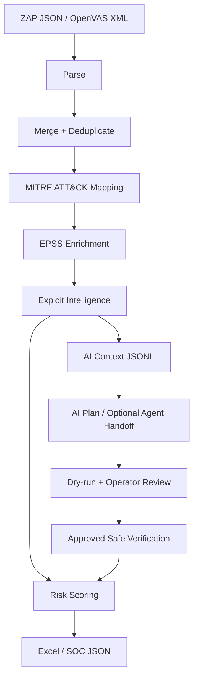

# VA Scan Pipeline — Exploit Intelligence và kiểm chứng an toàn trên production

Dự án này là một pipeline hỗ trợ Vulnerability Assessment nội bộ. Pipeline nhận dữ liệu từ ZAP/OpenVAS, chuẩn hoá các phát hiện, làm giàu CVE bằng EPSS và exploit intelligence, tính risk/priority, sau đó xuất báo cáo ở hai mức: bản nội bộ đầy đủ và bản customer-safe đã lược bỏ dữ liệu nhạy cảm.

Tool có hỗ trợ tạo queue và prompt cho AI agent. Tuy nhiên, với môi trường production, không nên để AI tự sinh script rồi tự chạy active verification một cách tự do. AI nên được dùng để đọc ngữ cảnh, lập kế hoạch kiểm chứng hoặc sinh logic bị giới hạn; phần gửi request thật nên do executor nội bộ đã được kiểm soát thực hiện.

Luồng active verification có checkpoint vận hành rõ ràng: verifier sinh theo từng run phải qua `py_compile`, qua `policy_validator.py`, chạy `--dry-run` để tạo `approval_manifest.json`, và chỉ được chạy live sau khi operator review/phê duyệt manifest. Đây là lớp kiểm soát an toàn bắt buộc trước khi gửi request thật tới target; xem thêm `docs/OPERATIONS.md` và `docs/SECURITY_MODEL.md`.

---

## 1. Mục tiêu

Pipeline hiện tập trung vào các việc sau:

1. Parse report từ ZAP và OpenVAS.
2. Giữ lại scanner evidence và scanner solution để không mất ngữ cảnh gốc.
3. Chuẩn hoá CVE/CWE, bao gồm các phát hiện có nhiều CVE trong cùng một dòng.
4. Tra EPSS theo từng CVE.
5. Tra public exploit/module/template theo CVE từ các nguồn local như Exploit-DB, Metasploit và Nuclei templates.
6. Tách riêng exploit intelligence khỏi kết quả kiểm chứng trên target.
7. Tính risk score và priority kèm lý do.
8. Xuất Excel/JSON cho nội bộ và bản đã lược bỏ dữ liệu nhạy cảm để chia sẻ an toàn hơn.
9. Xuất AI context dạng JSONL để agent đọc ít tốn token hơn so với CSV thô.

Nguyên tắc quan trọng:

- `PUBLIC_EXPLOIT_AVAILABLE` chỉ có nghĩa là tồn tại exploit/module/template public liên quan tới CVE.
- Trạng thái đó không chứng minh hệ thống của khách hàng đang có lỗ hổng đó.
- Chỉ nên xem `verification_status = REPRODUCED` hoặc `CONFIRMED_PRESENT` là bằng chứng ở mức target.

---

## 2. Ranh giới an toàn khi chạy trên production

Production không được xử lý như lab. Mọi bước kiểm chứng phải ưu tiên tính ổn định của hệ thống được đánh giá.

Các hành vi phù hợp:

- Chỉ kiểm tra host/URL nằm trong phạm vi.
- Ưu tiên `HEAD`, `GET` và các thao tác read-only.
- Dùng timeout ngắn, retry giới hạn và concurrency thấp.
- Dựa vào scanner evidence, header, status code, TLS config, banner/version và fixed-version boundary.
- Khi không đủ bằng chứng an toàn, dùng `NEEDS_MANUAL_REVIEW` hoặc `SKIPPED_SAFE_MODE`.

Các hành vi không nên tự động chạy trên production:

- Brute force hoặc thử default credential.
- Payload RCE, deserialization hoặc command execution.
- SSRF tới metadata endpoint, localhost hoặc host nội bộ ngoài phạm vi.
- File URI hoặc đọc file hệ thống/local file.
- Upload, write, delete, create account hoặc submit form có side effect.
- Fuzzing phá hoại, DoS hoặc crawling concurrency cao.
- In, log, lưu hoặc hardcode raw cookie/token/password.

Nếu cần kiểm chứng sâu hơn các trường hợp này, phải có approval riêng, phạm vi rõ ràng và người vận hành chịu trách nhiệm.

---

## 3. Trạng thái hiện tại của quy trình dùng AI

Pipeline hiện có thể tạo queue/prompt để một AI agent bên ngoài đọc context và sinh verifier theo từng run tại `$VA_RUN_DIR/generated/verify_vulns.py`.

Điểm cần nhìn thẳng:

- Một số model có thể từ chối nếu prompt yêu cầu viết và chạy verifier trực tiếp lên target cụ thể. Trường hợp này đã xảy ra với Antigravity CLI dùng Gemini.
- Một số model khác có thể không từ chối, nhưng vẫn có khả năng sinh code vượt quá policy production-safe.
- Vì vậy, không nên xem prompt là lớp bảo vệ duy nhất.

Kiến trúc hiện dùng cho production:

```text
scanner reports
  -> normalized queue
  -> compact AI context
  -> AI-generated verifier theo run
  -> policy validator + dry-run plan
  -> approval manifest bind hash target/queue/scope/context
  -> live verifier chỉ ghi verification_results.jsonl
  -> stable applier validate evidence và cập nhật queue/risk
  -> xuất report internal/customer-safe
```

Trạng thái hiện tại:

- Pipeline đã có queue, prompt production-safe và AI context JSONL.
- Pipeline đã có report schema tách exploit-intel và verification.
- Pipeline đã có `docs/VERIFY.md`, `policy_validator.py`, `verifier_lifecycle.py`, `apply_verification_results.py`.
- Generated verifier không được sửa CSV trực tiếp; chỉ xuất `verification_results.jsonl`.
- Live verification bị chặn nếu hash target/queue/scope/context/verifier thay đổi sau dry-run.

Vì vậy, nếu agent sinh verifier, vẫn cần review dry-run plan và approval manifest trước khi chạy live.

---

## 4. Các chế độ vận hành

### 4.1 Fast Exploit-Intel

Chế độ này không chứng minh target có lỗ hổng. Nó chỉ tra cứu CVE để xem có public exploit/module/template liên quan hay không.

Nguồn tra cứu hiện dùng:

- Exploit-DB/SearchSploit.
- Metasploit modules.
- Nuclei templates.

Các trường kết quả chính:

- `exploit_status`
- `exploit_available`
- `exploit_sources_json`
- `exploit_source_cves`
- `exploit_match_basis`
- `exploit_match_note`
- `exploit_context_review_required`
- `exploit_context_summary`
- `exploit_evidence`

Chế độ này phù hợp để triage nhanh, nhưng không thay thế verification.

### 4.2 Blackbox Verifier

Không dùng xác thực.

Mục tiêu là kiểm chứng an toàn bằng dữ liệu công khai/read-only:

- Không credential.
- Không default-login.
- Không brute force.
- Không payload nguy hiểm.
- Không gọi endpoint ngoài phạm vi.
- Ưu tiên header/status/TLS/banner/version evidence.

Nếu một phát hiện cần payload khai thác mới chứng minh được, nên đánh dấu `SKIPPED_SAFE_MODE` hoặc `NEEDS_MANUAL_REVIEW`.

### 4.3 Greybox Verifier

Có xác thực, nhưng chỉ để kiểm chứng read-only trong phạm vi được phép.

Quy tắc vận hành:

- Cookie/token không được đưa vào prompt, report hoặc log.
- Auth runtime nên đi qua `VA_AUTH_COOKIE` hoặc `VA_AUTH_HEADER`.
- Không submit form có side effect.
- Không thay đổi dữ liệu.
- Không thử bypass role, login hoặc MFA.

ZAP Greybox hiện inject cookie qua file cấu hình tạm của ZAP thay vì đưa raw cookie vào Docker process args. File tạm có permission `0600` và được xoá sau scan. Cách này giảm rủi ro lộ secret qua command line/log, nhưng vẫn không nên chạy trên host không tin cậy.

---

## 5. Luồng xử lý

```text
1. Nhận ZAP JSON / OpenVAS XML
2. Parse scanner output
3. Merge và deduplicate finding
4. Ánh xạ MITRE ATT&CK
5. Enrich EPSS
6. Tra exploit intelligence
7. Tạo verification queue / AI context nếu cần
8. Tính risk score và priority
9. Xuất Excel/JSON report
```


```mermaid
graph TD
    RAW["ZAP JSON / OpenVAS XML"] --> PARSE["Parse"]
    PARSE --> MERGE["Merge + Deduplicate"]
    MERGE --> MAP["MITRE ATT&CK Mapping"]
    MAP --> EPSS["EPSS Enrichment"]
    EPSS --> INTEL["Exploit Intelligence"]
    INTEL --> RISK["Risk Scoring"]
    INTEL --> AICTX["AI Context JSONL"]
    AICTX --> PLAN["AI Plan / Optional Agent Handoff"]
    PLAN --> REVIEW["Dry-run + Operator Review"]
    REVIEW --> VERIFY["Approved Safe Verification"]
    VERIFY --> RISK
    RISK --> REPORTS["Excel / SOC JSON"]
```

Lưu ý: `Approved Safe Verification` chỉ được chạy sau `py_compile`, policy validation, dry-run manifest và operator approval.

---

## 6. Cấu trúc thư mục

```text
tool-scan-pipeline-security/
├── data/
│   ├── raw/                         # ZAP JSON, OpenVAS XML, artifact tạm của scanner
│   ├── normalized/                  # CSV đã parse từ từng scanner
│   ├── output/                      # CSV đã merge/enrich/queue
│   ├── ai_context/
│   │   ├── internal/                # JSONL context đầy đủ cho nội bộ
│   │   └── customer_safe/           # JSONL context đã redact
│   └── reports/
│       ├── internal/                # Excel/JSON nội bộ, giữ evidence đầy đủ
│       └── customer_safe/           # Excel/JSON đã lược bỏ dữ liệu nhạy cảm
├── docs/
│   ├── README.md
│   ├── OPERATIONS.md
│   ├── SECURITY_MODEL.md
│   ├── VERIFY.md
│   └── RUN_LOG_TEMPLATE.md
├── config/
│   └── scope.example.yml
├── mapping/
│   └── attack_mapping_rules.yml
├── scripts/
│   ├── run_pipeline.py
│   ├── schema_utils.py
│   ├── antigravity_agent_bridge.py
│   ├── parse_zap.py
│   ├── parse_openvas.py
│   ├── merge_vulns.py
│   ├── apply_attack_mapping.py
│   ├── enrich_epss.py
│   ├── exploit_matcher.py
│   ├── calculate_risk_priority.py
│   ├── export_excel.py
│   ├── export_json_soc.py
│   ├── export_ai_context.py
│   ├── apply_verification_results.py
│   ├── policy_validator.py
│   ├── runtime_context.py
│   ├── verification_contract.py
│   ├── verifier_lifecycle.py
│   ├── refresh_queue_risk.py
│   ├── show_stats.py
│   └── test_portability.py
├── tests/
│   └── test_pipeline_regression.py
├── requirements.txt
├── setup.sh
└── runs/                           # Runtime artifacts nếu đặt VA_RUN_DIR/VA_RUN_ID
    └── <run_id>/generated/verify_vulns.py  # Verifier do AI sinh theo từng run
```

---

## 7. Cài đặt và chạy

### Cài đặt

```bash
chmod +x setup.sh
./setup.sh
source venv/bin/activate
python3 scripts/test_portability.py
```

Nếu không dùng `setup.sh`, cần đảm bảo các binary cần thiết nằm trong `PATH`.

Biến môi trường tuỳ chọn:

```bash
export METASPLOIT_MODULES_PATH="/your/custom/path/modules"
export NUCLEI_TEMPLATES_PATH="/your/custom/path/nuclei-templates"
```

### Scope runtime

Trước khi scan hoặc active verification trên production, tạo scope cho run:

```bash
cp config/scope.example.yml data/scope.yml
```

Nếu dùng run directory riêng:

```bash
export VA_RUN_DIR="$PWD/runs/customer-a-20260719"
mkdir -p "$VA_RUN_DIR"
cp config/scope.example.yml "$VA_RUN_DIR/scope.yml"
```

Có thể override path bằng:

```bash
export VA_SCOPE_FILE="/path/to/scope.yml"
```

Các field quan trọng:

- `allowed_hosts`: bắt buộc khai báo rõ host/IP được phép.
- `allowed_schemes`: thường là `http` hoặc `https`.
- `allowed_ports`: nên khai báo rõ trên production; ví dụ `443`.
- `allowed_methods`: mặc định chỉ nên dùng `GET`, `HEAD`, `OPTIONS`.
- `max_requests_per_second` và `max_concurrency`: giữ thấp với network/security device.

`run_pipeline.py` và `verifier_lifecycle.py` sẽ kiểm scope trước khi cho active contact target. Approval manifest cũng bind hash của `scope.yml`, nên nếu scope bị sửa sau dry-run thì live verifier sẽ bị từ chối.

### Chạy pipeline

```bash
source venv/bin/activate
python3 scripts/run_pipeline.py
```

Menu chính:

```text
1. Start Scan
2. Process Only
3. Exit
```

Ý nghĩa:

- `Start Scan`: chạy ZAP Docker, sau đó parse/enrich/report.
- `Process Only`: dùng dữ liệu scanner đã có trong `data/raw/`; hỗ trợ ZAP-only, OpenVAS-only hoặc cả hai.
- `Exit`: thoát.

Processing phase chỉ merge scanner input thật có trong lần chạy hiện tại. Nếu không có ZAP JSON hoặc OpenVAS XML tương ứng, normalized CSV cũ của scanner đó sẽ bị bỏ để tránh report lẫn dữ liệu target cũ.

Sau processing, pipeline hỏi chọn verification mode:

```text
[A] Generate Agent Verification Queue
[F] Fast Exploit-Intel Scan
```

Khuyến nghị khi chạy production:

- Chọn `F` để triage exploit-intel trước.
- Nếu chọn `A`, chỉ dùng agent để tạo plan hoặc code cần review. Không để agent chạy trực tiếp lên production nếu chưa có dry-run và approval.

---

## 8. Kết quả đầu ra chính

| File | Vị trí | Mô tả |
|---|---|---|
| `vuln_validation_queue.csv` | `data/output/` | File dữ liệu chính cho phát hiện, exploit-intel và verification fields |
| `vuln_attack_enriched.csv` | `data/output/` | Dataset sau mapping/risk baseline, trước phase exploit-intel |
| `vuln_attack_mapped.csv` | `data/output/` | Dataset sau MITRE ATT&CK mapping |
| `zap_findings.csv` | `data/normalized/` | Phát hiện ZAP ở mức alert |
| `zap_instances.csv` | `data/normalized/` | URL/parameter instance chi tiết của ZAP |
| `verification_context.jsonl` | `data/ai_context/internal/` | Context gọn cho AI agent, bản nội bộ |
| `zap_instances_compact.jsonl` | `data/ai_context/internal/` | ZAP instances đã rút gọn cho AI agent |
| `manifest.json` | `data/ai_context/internal/` | Metadata của AI context |
| `vuln_attack_report.xlsx` | `data/reports/internal/` | Excel nội bộ, giữ evidence đầy đủ và các sheet kỹ thuật |
| `vuln_attack_report.xlsx` | `data/reports/customer_safe/` | Excel gửi khách hàng, format 2 sheet tiếng Việt: `Tổng Quan` và `Chi Tiết Lỗ Hổng` |
| `vuln_report_soc.json` | `data/reports/internal/` | SOC JSON bản nội bộ |
| `vuln_report_soc.json` | `data/reports/customer_safe/` | SOC JSON đã lược bỏ dữ liệu nhạy cảm |

### 8.1 Excel gửi khách hàng

File Excel gửi khách hàng nên dùng:

```bash
$VA_RUN_DIR/reports/customer_safe/vuln_attack_report.xlsx
```

File này được thiết kế theo dạng report ngắn, dùng được trực tiếp cho
khách hàng:

- Sheet `Tổng Quan`: tiêu đề báo cáo, thông tin mục tiêu, nguồn dữ liệu, thời gian scan/report, thống kê theo mức độ, 2 biểu đồ phân bổ/số lượng theo mức độ và trạng thái kiểm chứng.
- Sheet `Chi Tiết Lỗ Hổng`: danh sách findings với 6 cột dễ đọc: `STT`, `Mức Độ`, `Plugin/CVE`, `Lỗ Hổng`, `Chi Tiết`, `Giải Pháp`. Cột `Mức Độ` là severity gốc từ scanner/CVSS và được sắp theo thứ tự `Critical` -> `High` -> `Medium` -> `Low` -> `Informational/Info` -> `Log` -> `Unknown`; priority xử lý như `P1`-`P4` nằm trong cột `Giải Pháp`.

Không đưa các sheet analyst/raw vào bản customer-safe Excel. Các sheet như raw
queue, exploit source detail, mapping review, ZAP instances và sensitive
evidence chỉ nằm trong bản internal:

```bash
$VA_RUN_DIR/reports/internal/vuln_attack_report.xlsx
```

### 8.2 Đưa JSON vào SOC/SIEM

File JSON mặc định nên đưa vào SOC/SIEM là bản customer-safe:

```bash
$VA_RUN_DIR/reports/customer_safe/vuln_report_soc.json
```

Nếu đang chạy development fallback và chưa set `VA_RUN_DIR`, đường dẫn tương ứng là:

```bash
data/reports/customer_safe/vuln_report_soc.json
```

Chỉ dùng bản internal khi SOC là hệ thống nội bộ tin cậy, có quyền xem full
scanner evidence, tool metadata và dữ liệu vận hành:

```bash
$VA_RUN_DIR/reports/internal/vuln_report_soc.json
```

Lưu ý: `customer_safe` ở đây nghĩa là đã giảm dữ liệu nhạy cảm vận hành
(secret, token, password, path nội bộ, tool metadata không cần thiết), không
phải bản anonymized. Feed SOC vẫn giữ host/IP/URL của tài sản trong phạm vi
khách hàng để SOC có thể correlate alert theo asset. Nếu cần gửi cho bên thứ ba
không được thấy topology, phải tạo một feed anonymized riêng.

Không đưa các file sau vào SOC như nguồn alert chính:

- `data/ai_context/...` hoặc `$VA_RUN_DIR/ai_context/...`: chỉ là context cho AI agent đọc.
- `approval_manifest.json`: dùng cho audit phê duyệt verifier, không phải finding feed.
- `verification/verification_results.jsonl`: raw output từ generated verifier, phải qua `apply_verification_results.py`.
- `output/vuln_validation_queue.csv`: queue trung gian, không phải schema SOC ổn định.
- `generated/verify_vulns.py`: code runtime do AI sinh theo từng run.

Semantics khi SOC parse `vuln_report_soc.json`:

- Top-level `reporting.ingest_contract` mô tả field nên dùng để ingest: `finding.dedup_hash` để deduplicate/upsert, `event.observed_at` làm thời điểm phát hiện và `verification.status` làm field quyết định target-level proof.
- Mỗi finding có `event.type = vulnerability_finding`, `event.action = upsert`, `finding.id`, `finding.dedup_hash` và `finding.dedup_basis`. SOC nên correlate theo `finding.dedup_hash`, không theo thứ tự dòng trong file.
- `target.host` là host/IP thuần; URL đầy đủ nằm trong `url.full`; port/protocol nằm trong `network.port` và `network.protocol`.
- `scanner.instance_count` và `scanner.affected_urls` giữ cardinality/phạm vi của alert-level finding, đặc biệt với ZAP.
- `verification.status = REPRODUCED` hoặc `CONFIRMED_PRESENT`: có bằng chứng target-level.
- `verification.target_level_proof = true` chỉ khi `verification.status` là `REPRODUCED` hoặc `CONFIRMED_PRESENT`.
- `verification.status = CHECKED_NOT_REPRODUCED`: đã kiểm tra an toàn nhưng không tái hiện.
- `verification.status = FALSE_POSITIVE`: có evidence cho thấy finding không áp dụng.
- `verification.status = NEEDS_MANUAL_REVIEW` hoặc `SKIPPED_SAFE_MODE`: không đủ điều kiện kiểm chứng an toàn tự động.
- `exploit_intel.available = true`: có public exploit/module/template theo CVE, nhưng không phải proof rằng target exploitable.
- `exploit_intel.intel_level = cve`: exploit intelligence đang ở mức CVE/source intelligence, không phải target proof.
- `reporting.soc_context` là nhãn triage cho SOC, đã tính đến priority để tránh biến P4 verified thành critical.

Rule vận hành: SOC không nên tạo incident “confirmed exploitable” nếu chỉ có
`exploit_intel.available=true` mà `verification.status` chưa phải
`REPRODUCED` hoặc `CONFIRMED_PRESENT`.

---

## 9. Trường dữ liệu quan trọng

Scanner/context:

- `scanner`
- `asset`
- `asset_type`
- `location`
- `url_or_port`
- `finding_name`
- `severity`
- `cvss`
- `plugin_id`
- `description`
- `scanner_evidence`
- `scanner_solution`
- `affected_urls_json`

CVE/CWE:

- `cve`
- `cve_list`
- `cwe`
- `cwe_list`

EPSS:

- `epss_score`
- `epss_percentile`
- `epss_source_cve`
- `epss_all_json`

Exploit intelligence:

- `exploit_status`
- `exploit_available`
- `exploit_sources_json`
- `exploit_source_cves`
- `exploit_match_basis`
- `exploit_match_note`
- `exploit_context_review_required`
- `exploit_context_summary`
- `exploit_evidence`

Verification:

- `verification_status`
- `verification_evidence`
- `verification_method`
- `verification_command`
- `verification_error`
- `verification_confidence`
- `verification_started_at`
- `verification_completed_at`
- `verification_safe_mode`

Risk/MITRE:

- `priority`
- `risk_score`
- `risk_reason`
- `risk_components_json`
- `attack_tactic`
- `attack_technique_id`
- `attack_technique_name`
- `attack_techniques_json`
- `attack_confidence`
- `needs_review`

---

## 10. Ý nghĩa trạng thái

### Verification status

| Status | Ý nghĩa |
|---|---|
| `NOT_VERIFIED` | Chưa có kiểm chứng ở mức target |
| `REPRODUCED` | Có bằng chứng trực tiếp, an toàn và gắn với target cụ thể |
| `CONFIRMED_PRESENT` | Có bằng chứng target-specific đủ mạnh, không cần exploit execution |
| `CHECKED_NOT_REPRODUCED` | Đã chạy safe check nhưng không tái hiện được |
| `FALSE_POSITIVE` | Evidence cho thấy phát hiện không áp dụng |
| `NEEDS_MANUAL_REVIEW` | Thiếu ngữ cảnh/approval hoặc cần người đánh giá |
| `SKIPPED_SAFE_MODE` | Không kiểm chứng tự động vì sẽ vượt policy production-safe |
| `ERROR` | Lỗi tool hoặc runtime |

### Exploit-intel status

| Status | Ý nghĩa |
|---|---|
| `PUBLIC_EXPLOIT_AVAILABLE` | Có exploit/module/PoC public liên quan tới CVE |
| `EXPLOIT_TEMPLATE_AVAILABLE` | Có template detection/verification liên quan |
| `NO_PUBLIC_EXPLOIT_FOUND` | Có CVE nhưng chưa thấy nguồn public trong local sources |
| `NO_CVE_ID` | Finding không có CVE để lookup |
| `INTEL_CHECK_ERROR` | Lookup lỗi |

Không dùng `exploit_status` để kết luận target có lỗ hổng. Nó chỉ là tín hiệu hỗ trợ ưu tiên xử lý.

---

## 11. AI context và cách dùng an toàn

Các file AI nên đọc:

```text
data/ai_context/internal/manifest.json
data/ai_context/internal/verification_context.jsonl
data/ai_context/internal/zap_instances_compact.jsonl
data/output/vuln_validation_queue.csv
```

Khi dùng với production, prompt cho agent nên có checkpoint rõ:

```text
Read docs/VERIFY.md first.
Do not run active verification yet.
Do not contact the production target.
Generate $VA_RUN_DIR/generated/verify_vulns.py.
Dry-run writes only $VA_RUN_DIR/verification/verification_plan.json.
Live mode writes only $VA_RUN_DIR/verification/verification_results.jsonl.
Do not update data/output/vuln_validation_queue.csv directly.
Wait for operator approval before any network action.
```

Sau khi agent sinh verifier, chạy lifecycle:

```bash
python3 scripts/verifier_lifecycle.py --mode BLACKBOX --verifier-file "$VA_RUN_DIR/generated/verify_vulns.py" dry-run https://target.example
python3 scripts/verifier_lifecycle.py --mode BLACKBOX --verifier-file "$VA_RUN_DIR/generated/verify_vulns.py" approve https://target.example --operator analyst
python3 scripts/verifier_lifecycle.py --mode BLACKBOX --verifier-file "$VA_RUN_DIR/generated/verify_vulns.py" run https://target.example
python3 -m unittest tests/test_pipeline_regression.py -v
```

Không chạy code agent sinh nếu thấy các pattern như:

- `shell=True`
- `os.system`
- dò quét bằng `socket` trực tiếp mà không qua allowlist
- SQLMap high-risk, crawl/forms, dump/schema enumeration hoặc OS shell
- brute-force/default credential loop
- follow redirect ra ngoài scope
- request tới metadata endpoint, localhost hoặc host nội bộ ngoài scope
- file URI hoặc đọc local/system file
- upload/write/delete/create action

---

## 12. Risk scoring

Risk score không chỉ dựa vào severity.

Các yếu tố chính:

- Scanner severity/CVSS.
- EPSS.
- Exploit intelligence.
- Verification status.
- Exposure.
- Độ mạnh của scanner evidence.
- Guardrail để tránh đẩy P1 chỉ vì có public exploit.

Priority hiện dùng:

| Priority | Ý nghĩa vận hành |
|---|---|
| P1 | Cần xử lý ngay hoặc review khẩn |
| P2 | Ưu tiên cao |
| P3 | Lên kế hoạch xử lý |
| P4 | Ghi nhận/theo dõi |

Mỗi row có `risk_reason` và `risk_components_json` để giải thích lý do xếp hạng.

---

## 13. Kiểm thử hiện có

Chạy regression tests:

```bash
./venv/bin/python -m unittest tests/test_pipeline_regression.py -v
```

Trạng thái test gần nhất ngày 2026-07-19:

```text
Ran 17 tests
OK
```

Test hiện bao phủ:

- Parser counts không bị mất.
- Merge hỗ trợ OpenVAS-only và không dùng stale ZAP normalized CSV.
- Schema chính có đủ scanner/exploit/verification context.
- Multi-CVE EPSS không bị mất.
- Exploit-intel tách khỏi verification.
- Risk guardrails.
- SOC JSON v1, ingest contract, dedup hash, UTC timestamp, target/url/network split và redaction.
- Excel customer layout, chart, severity sorting và redaction.
- AI context compact, không leak legacy exploit statuses.
- Prompt production-safe không leak cookie sentinel và không còn deny-list nguy hiểm cũ.
- ZAP auth config không đưa cookie vào Docker process args và reject CR/LF injection.
- Verifier lifecycle fixture chạy dry-run, approval hash binding, live result JSONL, apply evidence và risk recalculation.
- Mixed verification semantics trong SOC JSON: confirmed, false positive và public-exploit-only không bị map sai.

Khoảng trống còn lại:

- `policy_validator.py` vẫn không phải sandbox; code sinh bởi AI vẫn cần review.
- Chưa có sandbox OS/network-level cho generated verifier.
- Chưa unit-test đầy đủ mọi exporter bằng dữ liệu malformed/minimal.
- Chưa có lockfile dependency/checksum cho setup offensive tools.

---

## 14. Troubleshooting

| Vấn đề | Cách xử lý |
|---|---|
| OpenVAS không có XML | Export report XML vào `data/raw/`; pipeline tự chọn XML mới nhất. Nếu XML không tồn tại trong run hiện tại, normalized OpenVAS cũ sẽ không được merge |
| ZAP không gửi traffic | Kiểm tra target URL/protocol, Docker network, route/firewall và ZAP report trong `data/raw/` |
| Chỉ có OpenVAS, không có ZAP | Dùng `Process Only`; pipeline hỗ trợ OpenVAS-only |
| Chỉ có ZAP, không có OpenVAS | Dùng `Process Only`; pipeline hỗ trợ ZAP-only |
| Scope validation fail | Kiểm tra `data/scope.yml` hoặc `$VA_SCOPE_FILE`: `allowed_hosts`, scheme và port phải khớp target |
| Docker permission error | User cần quyền Docker hoặc chạy theo policy nội bộ |
| EPSS API lỗi | Kiểm tra network tới FIRST EPSS API; lỗi API không nên làm mất scanner data |
| Report có public exploit nhưng không có proof | Đây là đúng semantics; xem `verification_status` |
| Agent từ chối prompt | Chuyển prompt sang offline planner/dry-run, không yêu cầu chạy active target-specific code |
| Agent sinh code quá mạnh | Từ chối chạy trên production; cần validator/executor |
| Customer report còn secret | Dừng phát hành report, kiểm tra redaction và `sensitive_evidence` |

---

## 15. Changelog ngắn

### 2026-07-19 — Chuyển hướng production-safe verifier

- Rewrite prompt Blackbox/Greybox thành production presence verifier và trỏ về `docs/VERIFY.md`.
- Loại bỏ ngôn ngữ kiểu full-exploit/lab khỏi prompt.
- Thêm verification fields vào schema/report/AI context.
- Tạo compact AI context JSONL.
- Tách report internal và customer-safe.
- Sửa ZAP Greybox auth để không đưa raw cookie vào Docker process args.
- Thêm `verification_contract.py`, `verifier_lifecycle.py` và `apply_verification_results.py`.
- Chuyển generated verifier sang `$VA_RUN_DIR/generated/verify_vulns.py`; không còn dùng `scripts/verify_vulns.py` làm source ổn định.
- Live verifier chỉ xuất `verification_results.jsonl`; stable applier validate evidence rồi mới cập nhật queue/risk.
- Thêm regression tests cho lifecycle dry-run/approve/run, prompt safety, redaction, AI context và ZAP auth temp config.
- Thêm ZAP fragile baseline và chặn full scan nếu chưa bật override.

### Schema v1 / Exploit-intel semantics

- Tách `exploit_status` khỏi `verification_status`.
- Multi-CVE EPSS được xử lý đúng hơn.
- OpenVAS scanner solution/evidence được giữ lại.
- ZAP alert-level findings và instance-level URLs được tách riêng.
- MITRE mapping không cố ép coverage 100%.
- Excel/JSON có bản internal và customer-safe.

### Report/SOC/processing hardening

- Customer Excel chuyển sang format 2 sheet tiếng Việt, có chart trong `Tổng Quan`.
- Sheet `Chi Tiết Lỗ Hổng` sắp theo severity `Critical` -> `High` -> `Medium` -> `Low` -> `Informational/Info` -> `Log` -> `Unknown`; priority `P1`-`P4` nằm trong cột giải pháp.
- SOC JSON thêm ingest contract, `finding.id`, `finding.dedup_hash`, `event.action=upsert`, UTC timestamp, `verification.target_level_proof`, `exploit_intel.intel_level`, `scanner.instance_count`, `scanner.affected_urls`, `url` và `network`.
- Customer-safe SOC JSON giữ host/IP/URL để SOC correlation; đây không phải feed anonymized.
- Processing phase hỗ trợ ZAP-only, OpenVAS-only hoặc cả hai.
- Processing phase bỏ normalized scanner CSV cũ khi raw source tương ứng không có trong run hiện tại để tránh lẫn dữ liệu target cũ.
- `test_portability.py` kiểm đủ các script runtime/lifecycle/report chính.

---

## 16. License & Credits

Author: Tc3s

License: MIT
