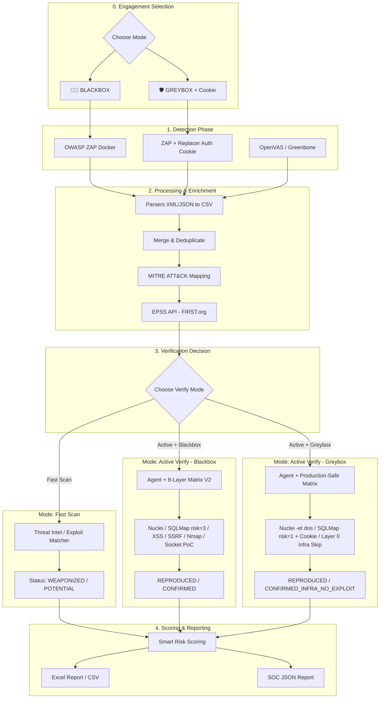

# 🛡️ Automated Vulnerability Management Pipeline

**From Detection to Verification: A Closed-Loop Security Pipeline with Threat Intelligence**

_Hệ thống quản lý lỗ hổng bảo mật tự động: hợp nhất dữ liệu scan (ZAP / OpenVAS), chuẩn hoá, ánh xạ MITRE ATT&CK, làm giàu dữ liệu (EPSS & Exploit Matcher), tính điểm rủi ro đa biến và tự động xác thực bằng Heuristic/AI Agent, cuối cùng xuất báo cáo chuẩn SOC._

---

## 1. Tổng quan (Overview)

Mục tiêu: giảm **Alert Fatigue** trong DevSecOps bằng một pipeline khép kín — từ phát hiện (detection), làm giàu (enrichment), xếp hạng (risk scoring) đến **xác thực tự động** (active verification) trước khi tạo báo cáo cho team.

Pipeline hỗ trợ **2 chế độ Engagement (Đa Chế Độ)**:
- **🏴‍☠️ BLACKBOX PENTEST** — Quét không xác thực. Sử dụng toàn bộ sức mạnh khai thác (SQLMap risk=3, Nuclei full, Nmap aggressive). Phù hợp cho Pentest mục tiêu bên ngoài.
- **🛡️ GREYBOX AUDITOR** — Quét có xác thực (Session Cookie/Token). Giới hạn sát thương để bảo vệ dữ liệu Production. Tự động bỏ qua tấn công Hạ tầng (OS/Network) vì tin tưởng dữ liệu Credentialed của Admin.

Quy trình chính:

1. **Engagement Selection** — Chọn chế độ quét: Blackbox hoặc Greybox Auditor (nhập Session Cookie nếu cần).
2. **Detection** — OWASP ZAP (Web DAST) chạy qua Docker + OpenVAS / Greenbone (Infra/OS). Ở chế độ Greybox, ZAP tự động inject Auth Cookie vào mọi request qua Replacer config.
3. **Parsing & Normalization** — Chuyển đổi XML/JSON → CSV chuẩn chung, tự động gộp và loại bỏ trùng lặp (Deduplicate).
4. **MITRE ATT&CK Mapping** — Ánh xạ tự động CWE/CVE → Tactic/Technique của MITRE để hiểu rõ hành vi kẻ tấn công.
5. **Threat Intelligence Enrichment** — Tích hợp API của FIRST.org để lấy điểm EPSS và truy vấn mã khai thác công khai (Exploit-DB, Metasploit, Nuclei).
6. **Smart Risk Scoring** — Engine gán Priority (P1…P4) dựa trên thang điểm 100 (Base Severity + EPSS + Exploit Availability).
7. **Verification (Interactive)** — Cho phép chọn chế độ *Fast Scan* hoặc *Active Verification*. Agent AI nhận Prompt khác nhau tùy theo Engagement Mode (Blackbox: 8-Layer bạo lực / Greybox: Production-Safe với Layer 0 bảo vệ hạ tầng).
8. **Reporting** — Xuất Excel màu sắc trực quan + CSV + **JSON chuẩn SOC** tích hợp thẳng vào SIEM.

---

## 2. Tính năng chính (Key Features)

- **Multi-Engagement Mode (ĐA CHẾ ĐỘ)**:
  - **Blackbox Pentest**: Quét không xác thực, sức mạnh khai thác tối đa. SQLMap `--risk 3 --level 3`, Nuclei full templates, Nmap aggressive scripts.
  - **Greybox Auditor**: Quét có xác thực (Cookie/Token), an toàn cho Production. SQLMap `--risk 1 --level 1 --technique=BEU`, Nuclei loại trừ template DoS (`-et tags:dos,intrusive`), tự động bỏ qua tấn công hạ tầng OS/Network.
- **ZAP Authenticated Scanning**: Ở chế độ Greybox, Cookie được inject tự động vào Docker ZAP qua cấu hình `-config replacer.full_list(0)...`, cho phép ZAP cày sâu vào các trang yêu cầu đăng nhập.
- **Hybrid Scanning**: Nhận input ZAP JSON (Traditional Format) và OpenVAS XML.
- **Unified Data Model**: Chuẩn hóa mọi report về CSV trung gian để dễ xử lý/gộp.
- **MITRE ATT&CK Mapping**: Ánh xạ tự động tactic/technique dựa trên CWE/CVE/rule (Rule-based kết hợp AI fallback). Bao phủ 50+ rules cho các lớp tấn công: SQLi, XSS, SSRF, Path Traversal, 403 Bypass, Infrastructure (FTP/SMB), Deserialization/RCE.
- **Threat Intelligence (Exploit Matcher)**: Tự động tìm kiếm mã khai thác đã được "Weaponized". Regex search sâu vào thư mục Metasploit, quét Nuclei templates và SearchSploit. Cơ chế Smart Discovery tự tìm tool ở nhiều vị trí cài đặt trên Linux.
- **EPSS Scoring Integration**: Kết nối trực tiếp API `api.first.org` để lấy điểm dự đoán khả năng bị khai thác (EPSS) theo thời gian thực. Hỗ trợ batch query.
- **Smart Risk Scoring**: Chấm điểm rủi ro từ 0-100. Base Score + EPSS Addon (Max 50) + Weaponized Addon (+50). Tự động gán Priority P1 → P4. Engine đồng bộ giữa chạy pipeline và chạy script độc lập.
- **Prompt-Driven Code Generation (AI Agent)**:
  - Pipeline tự sinh Prompt chuyên biệt cho AI Agent dựa trên Engagement Mode.
  - Agent đọc Prompt và tự động sinh ra file `verify_vulns.py` với logic khai thác phù hợp.
  - Prompt khác nhau hoàn toàn giữa Blackbox (8-Layer bạo lực) và Greybox (Production-Safe với Layer 0 Infra Shield).
- **Dynamic Path Architecture**: Toàn bộ project sử dụng cơ chế `PROJECT_ROOT` tự động nhận diện — không có đường dẫn tuyệt đối nào bị "cứng" trong code. Clone về là chạy ngay.
- **1-Click Setup**: Script `setup.sh` tự động cài đặt toàn bộ dependencies, tools, và warm-up databases.
- **Portability Check**: Script `test_portability.py` kiểm tra toàn diện sức khỏe môi trường trước khi chạy.
- **Export Đa Định Dạng**: `vuln_attack_report.xlsx`, `vuln_attack_enriched.csv`, `vuln_validation_queue.csv`, và `vuln_report_soc.json`.

---

## 3. Cơ chế hoạt động của Agent — Ma trận quyết định

Agent tuân thủ ma trận quyết định nhiều lớp nhằm đảm bảo tính chính xác, ưu tiên sử dụng công cụ chuyên dụng, và fallback an toàn khi công cụ không sẵn sàng.

### 3.1 Blackbox Mode — Ma trận 8 lớp (Elite V2 Full Coverage)

**Layer 1 — Sniper (Nuclei CVE Loop)**  
Ưu tiên nếu template Nuclei khớp với CVE → Loop từng CVE một. Có cơ chế retry khi timeout.

**Layer 2A — Heavy Artillery (SQL Injection)**  
SQLMap `--level 3 --risk 3 --batch --forms --crawl=2`. Tự động trích xuất URL có tham số từ CSV thay vì bắn mù vào root domain. Fallback: WPScan nếu phát hiện WordPress.

**Layer 2B — XSS Hunter (Cross-Site Scripting)**  
Kiểm tra 5+ payload XSS (`<script>alert(1)</script>`, `">`, `{{7*7}}`...) trên mọi tham số. Chỉ `REPRODUCED` khi payload được reflect nguyên vẹn (không bị HTML encoding). Kết hợp `nuclei -tags xss`.

**Layer 3A — Web Surgeon (403 Bypass & Path Traversal)**  
22+ payloads Path Traversal + 12+ kỹ thuật 403 Bypass. Test cả root path lẫn parameters (`?file=`, `?page=`, `?include=`, `?template=`). Apache CVE-2021-41773 style PoC.

**Layer 3B — SSRF Probe (Server-Side Request Forgery)**  
Inject SSRF payloads vào các tham số URL-type: `http://127.0.0.1`, `http://169.254.169.254/latest/meta-data/` (AWS), `file:///etc/passwd`. Phát hiện leak nội bộ.

**Layer 4 — Infra Engineer (Nmap/NSE)**  
`nmap -sV -Pn --script vulners,ssh2-enum-algos,ssl-enum-ciphers`. Chỉ `CONFIRMED_PRESENT` khi có exploit path rõ ràng. Version match đơn thuần = `CHECKED_NO_EXPLOIT`.

**Layer 5 — Protocol Specialist (Service-Specific PoC)**  
PoC chuyên biệt cho từng giao thức:
- **vsftpd** (port 21): Backdoor smiley `:)` (CVE-2011-2523) → kiểm tra port 6200.
- **ProFTPD**: `SITE CPFR/CPTO` arbitrary file copy.
- **rlogin** (port 513): Thử `-froot` passwordless login.
- **rexec** (port 512): Brute common creds.
- **dRuby** (port 8787): DRb protocol probe.
- **SMB/Samba** (port 445): `smbclient -L //TARGET -N` null session.

**Layer 6 — Deserialization & RCE Hunter**  
PHP Unserialize, Java ysoserial, Python pickle. Command injection tests: `; id`, `| id`, `` `id` ``, `$(id)`. Kết hợp `nuclei -tags rce,java`.

**Layer 7 — Safety Net**  
Nếu tất cả Layer thất bại → `CHECKED_NO_EXPLOIT`. TCP open ≠ proof.

### 3.2 Greybox Mode — Ma trận Production-Safe

**Layer 0 — Infra Shield (AUTO-SKIP)**  
Tự động nhận diện và bỏ qua toàn bộ lỗi Hạ tầng/OS (SSH, SMB, Kernel, vsftpd, ProFTPD, SSL/TLS, PostgreSQL EOL...) → `CONFIRMED_INFRA_NO_EXPLOIT`. Không gọi bất kỳ tool tấn công nào.

**Layer 1 — Sniper (Nuclei Authenticated)**  
`nuclei -id [CVE] -H 'Cookie: {auth_cookie}' -et tags:dos,intrusive` — Loại trừ template phá hoại.

**Layer 2 — Safe Artillery (Low-Risk SQLi)**  
`sqlmap --level 1 --risk 1 --batch --cookie='{auth_cookie}' --technique=BEU` — Chỉ Boolean/Error/Union, không stacked queries.

**Layer 3 — Web Surgeon (Authenticated)**  
Mọi `requests.get/post` đều kẹp `headers={'Cookie': auth_cookie}`. Test 403 bypass + path traversal qua tham số.

**Layer 4 — DISABLED**  
Nmap chỉ dùng `--script 'safe'` nếu thực sự cần.

### 3.3 Tính năng chung cho cả 2 Mode

- **Smart URL Extraction**: Trích xuất URL có tham số từ cột `description` / `url_or_port` trong CSV thay vì bắn mù vào root domain.
- **Retry & Fallback Logic**: Timeout → retry 1 lần với 2x timeout. Connection refused → thử switch http ↔ https. Tool not found → fallback Python `requests`.
- **Evidence Bottom-Up**: Hàm `extract_evidence()` cắt output từ cuối lên (bottom-up) để bỏ qua banner rác của tool (SQLMap art, Nuclei logo).
- **Internal Runtime Caching**: `CMD_CACHE` (nhớ mọi kết quả lệnh) + `NMAP_CACHE` (nhớ theo port).

---

## 4. Kiến trúc (Architecture)


```mermaid
graph TD

subgraph Phase_0_Engagement ["0. Engagement Selection"]
    MODE{"Choose Mode"}
    BB["🏴‍☠️ BLACKBOX"]
    GB["🛡️ GREYBOX + Cookie"]
end

subgraph Phase_1_Detection ["1. Detection Phase"]
    ZAP["OWASP ZAP Docker"]
    ZAP_AUTH["ZAP + Replacer Auth Cookie"]
    GVM["OpenVAS / Greenbone"]
end

subgraph Phase_2_Processing ["2. Processing & Enrichment"]
    PARSERS["Parsers XML/JSON to CSV"]
    MERGE["Merge & Deduplicate"]
    MAP["MITRE ATT&CK Mapping"]
    EPSS["EPSS API - FIRST.org"]
end

subgraph Phase_3_Decision ["3. Verification Decision"]
    CHOICE{"Choose Verify Mode"}
end

subgraph Mode_Fast ["Mode: Fast Scan"]
    EXPLOIT["Threat Intel / Exploit Matcher"]
    FS_OUT["Status: WEAPONIZED / POTENTIAL"]
end

subgraph Mode_Active_BB ["Mode: Active Verify - Blackbox"]
    AGENT_BB["Agent + 8-Layer Matrix V2"]
    TOOLS_BB["Nuclei / SQLMap risk=3 / XSS / SSRF / Nmap / Socket PoC"]
    AV_BB_OUT["REPRODUCED / CONFIRMED"]
end

subgraph Mode_Active_GB ["Mode: Active Verify - Greybox"]
    AGENT_GB["Agent + Production-Safe Matrix"]
    TOOLS_GB["Nuclei -et dos / SQLMap risk=1 + Cookie / Layer 0 Infra Skip"]
    AV_GB_OUT["REPRODUCED / CONFIRMED_INFRA_NO_EXPLOIT"]
end

subgraph Phase_4_Reporting ["4. Scoring & Reporting"]
    SCORE["Smart Risk Scoring"]
    EXCEL["Excel Report / CSV"]
    SOC["SOC JSON Report"]
end

%% Luồng Engagement
MODE --> BB
MODE --> GB
BB --> ZAP
GB --> ZAP_AUTH
ZAP --> PARSERS
ZAP_AUTH --> PARSERS
GVM --> PARSERS

%% Processing
PARSERS --> MERGE
MERGE --> MAP
MAP --> EPSS
EPSS --> CHOICE

%% Fast Scan
CHOICE -- "Fast Scan" --> EXPLOIT
EXPLOIT --> FS_OUT
FS_OUT --> SCORE

%% Active - Blackbox
CHOICE -- "Active + Blackbox" --> AGENT_BB
AGENT_BB --> TOOLS_BB
TOOLS_BB --> AV_BB_OUT
AV_BB_OUT --> SCORE

%% Active - Greybox
CHOICE -- "Active + Greybox" --> AGENT_GB
AGENT_GB --> TOOLS_GB
TOOLS_GB --> AV_GB_OUT
AV_GB_OUT --> SCORE

%% Reporting
SCORE --> EXCEL
SCORE --> SOC
```

## 5. Cấu trúc thư mục (Project Structure)

```plaintext
tool-scan-pipeline-security/
├── data/
│   ├── raw/                # Input: openvas_report.xml, zap_report.json
│   ├── normalized/         # Intermediate CSVs (zap_findings, openvas_findings)
│   └── output/             # Enriched CSVs, validation queue
├── docs/
│   └── README.md           # Tài liệu dự án (file này)
├── mapping/
│   └── attack_mapping_rules.yml  # Luật mapping MITRE ATT&CK (50+ rules)
├── scripts/
│   ├── run_pipeline.py            # MASTER: CLI orchestrator + Prompt Generator
│   ├── antigravity_agent_bridge.py# Agent core / scheduler queue creator
│   ├── verify_vulns.py            # [AUTO-GENERATED] Verification script (sinh bởi AI Agent)
│   ├── parse_zap.py               # Parser ZAP JSON → CSV
│   ├── parse_openvas.py           # Parser OpenVAS XML → CSV
│   ├── merge_vulns.py             # Dedupe & merge findings
│   ├── apply_attack_mapping.py    # MITRE ATT&CK mapping engine
│   ├── enrich_epss.py             # Gọi API FIRST.org lấy EPSS (single + batch)
│   ├── exploit_matcher.py         # SearchSploit, Metasploit, Nuclei matcher (Smart Discovery)
│   ├── calculate_risk_priority.py # Risk scoring engine (0-100 + EPSS + Weaponized)
│   ├── export_excel.py            # Export XLSX kèm conditional formatting
│   ├── export_json_soc.py         # Export JSON chuẩn SIEM/SOC
│   ├── show_stats.py              # Quick stats viewer cho findings
│   └── test_portability.py        # Kiểm tra tính khả dụng & đường dẫn
├── setup.sh                       # 1-Click Install & Warm-up (Ubuntu 24.04)
├── requirements.txt               # Python dependencies
├── pipeline.log                   # Log chi tiết (rotating, 5 × 5MB)
├── vuln_attack_report.xlsx        # [OUTPUT] Báo cáo Excel cuối cùng
├── vuln_report_soc.json           # [OUTPUT] JSON chuẩn SOC
└── venv/                          # Python virtual environment
```

---

## 6. Yêu cầu & Cài đặt (Requirements & Setup)

### Kiến trúc đường dẫn động (Dynamic Path Architecture)

Toàn bộ project sử dụng cơ chế `PROJECT_ROOT` tự động nhận diện dựa trên vị trí file script. Không có đường dẫn tuyệt đối nào bị "cứng" (hardcoded) trong code. Bạn có thể:
- Clone project về bất kỳ thư mục nào trên Linux.
- Chạy script từ thư mục gốc hoặc từ trong `scripts/`.
- Cài tool bằng `apt`, `go install`, `git clone`, hoặc `wget` — Pipeline tự phát hiện qua `PATH`.

### Yêu cầu hệ thống

- **OS**: Linux (Khuyến nghị Ubuntu 24.04 / Kali Linux)
- **Python**: 3.10+
- **Quyền**: `sudo` để cài đặt system dependencies
- **Docker** (tùy chọn): Cho OWASP ZAP & OpenVAS containers

### Cài đặt 1-Chạm (1-Click Setup)

Script `setup.sh` sẽ tự động thực hiện **7 bước**:
1. Cập nhật system packages (`apt update`).
2. Cài đặt công cụ CLI (`nmap`, `sqlmap`, `nikto`, `wpscan`, `curl`, `git`).
3. Thiết lập môi trường ảo Python (`venv`) và cài thư viện từ `requirements.txt`.
4. Tải bản Binary mới nhất của **Nuclei** từ GitHub Releases.
5. Clone **SearchSploit** (Exploit-DB) mới nhất từ GitLab.
6. Tạo cấu trúc thư mục `data/`.
7. **Warm-up tools**: Cập nhật databases cho WPScan, Nmap NSE, SearchSploit và Pre-pull Docker image ZAP.

```bash
# Tại thư mục gốc project
chmod +x setup.sh
./setup.sh

# Sau khi cài đặt hoàn tất, kiểm tra tính khả dụng:
source venv/bin/activate
python3 scripts/test_portability.py
```

### Cài đặt tool theo cách riêng (Manual)

Nếu bạn không dùng `setup.sh`, pipeline vẫn hoạt động miễn là các binary nằm trong `PATH`.  
Hỗ trợ cài qua: `apt install`, `go install`, `git clone`, hoặc `wget` + giải nén vào `/usr/local/bin/`.

Các biến môi trường tuỳ chỉnh (nếu cài tool ở vị trí đặc biệt):
```bash
export METASPLOIT_MODULES_PATH="/your/custom/path/modules"
export NUCLEI_TEMPLATES_PATH="/your/custom/path/nuclei-templates"
```

### Chuẩn bị Scanner (Docker)

- **OpenVAS (Greenbone)**: Tải docker-compose.yml chính thức của Greenbone, `docker compose up -d`, chờ feed sync. Export report dạng XML và lưu vào `data/raw/<tên_file>.xml`.
- **OWASP ZAP**: Script `run_pipeline.py` đã tích hợp sẵn lệnh gọi image `ghcr.io/zaproxy/zaproxy:stable`.

### Chạy pipeline

```bash
source venv/bin/activate
python3 scripts/run_pipeline.py
```

### Menu chính CLI

```
1. Start Scan    — Chọn Engagement Mode → Docker ZAP scan → Processing → Threat Intel → Verify.
2. Process Only  — Chọn Engagement Mode → Xử lý data sẵn có → Threat Intel → Verify.
3. Exit          — Thoát.
```

### Quy trình tương tác chi tiết

**Bước 1: Chọn Engagement Type**
```
[ ENGAGEMENT TYPE ]
  1. 🏴‍☠️ BLACKBOX PENTEST — Unauthenticated, Full Exploit Power
  2. 🛡️  GREYBOX AUDITOR  — Authenticated, Production-Safe
👉 Choose Engagement Type (1-2, Default: 1):
```
- Nếu chọn Greybox: Hệ thống hỏi thêm Session Cookie.
- Cookie được inject vào ZAP Docker (Replacer config) và truyền xuống Agent Prompt.

**Bước 2: Chọn ZAP Scan Mode**
```
1. ⚡ Quick Baseline Scan
2. 🐢 Full Deep Scan (Recommended)
3. 🕷️ AJAX Spider Scan
```

**Bước 3: Chọn Verification Mode**
```
[A] Active Verification — Bật Agent, sử dụng tool mạng bắn payload thật.
[F] Fast Scan            — Chỉ Threat Intel (Exploit-DB/EPSS), KHÔNG gửi request mạng.
```
- Nếu chọn Active: Agent AI nhận Prompt tương ứng với Engagement Mode đã chọn ở Bước 1.

---

## 7. Outputs & Trường dữ liệu quan trọng

Các file xuất chính:

| File | Vị trí | Mô tả |
|---|---|---|
| `vuln_attack_report.xlsx` | Project root | Báo cáo cuối: Priority, MITRE ATT&CK, Risk Score, EPSS, Agent Status, Evidence (tô màu) |
| `vuln_report_soc.json` | Project root | JSON chuẩn SOC: THREAT_INTEL_MATCH / CRITICAL_ACTION_REQUIRED / FALSE_POSITIVE_FILTERED |
| `vuln_validation_queue.csv` | `data/output/` | Hàng đợi xác thực chi tiết (mỗi lỗ hổng = 1 task của Agent) |
| `vuln_attack_enriched.csv` | `data/output/` | Dataset gốc đã làm giàu đầy đủ dữ liệu (EPSS, ATT&CK, Risk Score) |
| `vuln_attack_mapped.csv` | `data/output/` | Dataset sau bước ATT&CK mapping (trước Risk Scoring) |

Trường chính đáng chú ý:  
`id`, `host`, `port`, `cve`, `cwe`, `attack_tactic`, `attack_technique_id`, `epss_score`, `epss_percentile`, `exploit_available`, `priority` (P1–P4), `risk_score`, `agent_status`, `agent_command`, `agent_evidence`.

---

## 8. Trạng thái xác thực (Agent Status Codes)

### Chế độ Active Verification

| Status | Ý nghĩa |
|---|---|
| `REPRODUCED` | Đã tái hiện thành công kịch bản tấn công (PoC success: nuclei hit, SQLi injectable, XSS reflected, 403 bypass → 200, SSRF leak, backdoor confirmed) |
| `CONFIRMED_PRESENT` | Lỗ hổng cấu hình có thật + có Exploit Path rõ ràng (VD: weak cipher + downgrade possible) |
| `CONFIRMED_INFRA_NO_EXPLOIT` | **(Chỉ Greybox Mode)** Lỗ hổng Hạ tầng/OS từ OpenVAS. Tin tưởng dữ liệu Credentialed Admin, bỏ qua tấn công để bảo vệ Production |
| `CHECKED_NO_EXPLOIT` | Đã kiểm tra kỹ, dịch vụ tồn tại nhưng KHÔNG có exploit proof |
| `NOT_REPRODUCED` | Không thể tái hiện điều kiện lỗi |
| `ERROR` | Tool lỗi hoặc exception |

### Chế độ Fast Scan

| Status | Ý nghĩa |
|---|---|
| `WEAPONIZED` | Đã tìm thấy public exploit (Exploit-DB, Nuclei, Metasploit) |
| `POTENTIAL` | Có CVE nhưng chưa tìm thấy mã khai thác công khai |
| `SKIPPED_NO_CVE` | Lỗ hổng không có mã định danh CVE để tra cứu |

---

## 9. Mapping MITRE & Smart Risk Scoring

### MITRE ATT&CK Mapping

File `mapping/attack_mapping_rules.yml` chứa **50+ luật ánh xạ** bao phủ toàn bộ 8-Layer Attack Matrix:

| Category | Techniques Covered |
|---|---|
| Initial Access | CWE-79 (XSS), CWE-89 (SQLi), CVE-*, File Upload, Deserialization, FTP Backdoor |
| Execution | Dangerous Functions, MIME Sniffing |
| Persistence | Web Shell, RCE, SQLi → Backdoor |
| Privilege Escalation | SUID, Sudoers, PE vulns |
| Defense Evasion | Clickjacking, Cookie, 403 Bypass |
| Credential Access | HttpOnly, SameSite, Brute Force, Hardcoded Passwords |
| Discovery | Path Traversal (CWE-22), Server Banner, Directory Listing |
| Lateral Movement | SSRF (CWE-918), SMB Null Session |
| Collection | Source Code Disclosure, DB Exposure, API |
| Impact | DoS (T1499), Resource Exhaustion |
| Infrastructure | vsftpd, ProFTPD, FTP Anonymous, SMB/Samba, EternalBlue |

### Risk Scoring Engine (Thang 0-100)

| Thành phần | Công thức | Max |
|---|---|---|
| Base Score | Critical=90, High=70, Medium=40, Low=10, Info=0 | 90 |
| EPSS Addon | `EPSS * 100 * 0.5` | 50 |
| Weaponized Addon | `+50` nếu `exploit_available == True` | 50 |
| **Tổng (Capped)** | **Min(sum, 100)** | **100** |

### Priority Rules

| Priority | Điều kiện | SLA Hành động |
|---|---|---|
| P1 (Critical) | Score ≥ 90 | Hành động ngay lập tức (24h) |
| P2 (High) | Score ≥ 70 | Ưu tiên xử lý trong 72h |
| P3 (Medium) | Score ≥ 40 | Lên kế hoạch vá lỗi (30 ngày) |
| P4 (Info) | Score < 40 | Ghi nhận, theo dõi |

> **Lưu ý**: Engine tính điểm được tích hợp trực tiếp trong `scripts/calculate_risk_priority.py` để đảm bảo tính di động. Cả pipeline lẫn chạy script độc lập đều cho cùng kết quả.

---

## 10. Best Practices & Lưu ý vận hành

### Nguyên tắc chung
- **Chỉ quét hệ thống được phép** — Tuân thủ pháp luật & chính sách công ty.
- **Rate Limit API** — Module EPSS gọi `api.first.org`. Tránh quét hàng ngàn CVE liên tục.

### Blackbox Mode
- Các kịch bản Active Scan (SQLMap risk=3) có thể gây gián đoạn dịch vụ hoặc ghi đè dữ liệu.
- Chỉ nên dùng trên lab/mục tiêu được phép pentest.

### Greybox Mode (Production)
- **Xin Session Cookie mới** trước mỗi lần quét (Cookie hết hạn = quét như không đăng nhập).
- SQLMap risk=1 + technique=BEU an toàn cho Database Production (không dùng stacked queries).
- Nuclei loại trừ `-et tags:dos,intrusive` để tránh crash ứng dụng.
- Lỗi Hạ tầng (OpenVAS) được tự động bỏ qua tấn công — xuất nguyên trạng cho team Infra xử lý.

### Ghi log & Audit
- Mọi action được ghi chi tiết trong `pipeline.log` (rotating, 5 file × 5MB).
- Thử nghiệm Agent trên lab trước khi bật full automation trên production.

---

## 11. Troubleshooting — Vấn đề thường gặp

| Vấn đề | Giải pháp |
|---|---|
| OpenVAS thiếu dữ liệu | Kiểm tra logs `gvmd` & chờ SCAP/CERT sync hoàn tất |
| Agent không tìm thấy tool (nuclei/sqlmap) | Chạy `setup.sh` hoặc kiểm tra `PATH`. Agent fallback sang Python nhưng tính năng hạn chế |
| Docker permission errors | Chạy bằng user có quyền docker hoặc `sudo usermod -aG docker $USER` |
| EPSS API lỗi | Kiểm tra kết nối mạng, thử `curl https://api.first.org/data/v1/epss?cve=CVE-2021-44228` |
| ZAP Connection Refused | Kiểm tra protocol (http vs https), port target, và `--network host` trong Docker |
| SQLMap bắn mù vào root URL | Agent sẽ trích xuất URL có tham số từ CSV. Nếu vẫn bắn mù, kiểm tra dữ liệu cột `url_or_port` |
| Evidence chứa banner rác (SQLMap art) | `extract_evidence()` cắt từ cuối lên (bottom-up) |
| Pipeline crash khi gọi `run_scanning_phase()` | Hàm trả về tuple `(url, scan_context)`. Đảm bảo caller tách tuple đúng cách |
| `ModuleNotFoundError: pandas` | Luôn dùng `venv/bin/python3` thay vì `python3` hệ thống |
| Tool cài bằng Go/Wget không nhận | Đảm bảo binary nằm trong `PATH` (`~/go/bin`, `/usr/local/bin`) hoặc dùng biến môi trường `NUCLEI_TEMPLATES_PATH` |
| `test_portability.py` báo thiếu thư mục | Chạy `setup.sh` để tạo cấu trúc thư mục `data/` |

---

## 12. Changelog

### V2.1 (04/2026) — Dynamic Architecture + Full Coverage Mapping
- **[NEW]** `setup.sh`: Script cài đặt 1-chạm toàn diện (APT, Nuclei binary, Exploit-DB từ GitLab, Tool Warm-up).
- **[NEW]** `test_portability.py`: Script kiểm tra sức khỏe môi trường (CLI tools, directories, Smart Discovery).
- **[NEW]** Dynamic Path Architecture: Tự động nhận diện `PROJECT_ROOT` trong toàn bộ 11 scripts. Loại bỏ 100% hardcoded paths.
- **[NEW]** Smart Tool Discovery: `exploit_matcher.py` tự tìm Metasploit modules và Nuclei templates ở nhiều vị trí. Hỗ trợ biến môi trường override.
- **[NEW]** MITRE Mapping mở rộng: Bổ sung rules cho Path Traversal (CWE-22), 403 Bypass, XSS (ZAP pattern), FTP/vsftpd/ProFTPD, SMB/Samba. Sửa lỗi DoS mapping sai (T1561→T1499).
- **[NEW]** Risk Engine V2 đồng bộ: `calculate_risk()` standalone giờ dùng cùng engine 0-100 với pipeline (có EPSS + Weaponized addon).
- **[CLEANUP]** Xóa file `risk_weights.yml` (legacy, không được code nào sử dụng).
- **[FIX]** `show_stats.py`: Dynamic path thay vì hardcoded relative path.

### V2.0 (04/2026) — Multi-Engagement Mode + Elite Prompt V2
- **[NEW]** Chế độ GREYBOX AUDITOR: Quét có xác thực, bảo vệ Production.
- **[NEW]** ZAP Cookie Injection qua Docker Replacer config.
- **[NEW]** Layer 0 Infra Shield: Tự động bỏ qua tấn công Hạ tầng ở Greybox Mode.
- **[NEW]** Prompt Blackbox V2: 8-Layer bao phủ XSS, SSRF, Deserialization/RCE, Protocol-Specific PoC.
- **[NEW]** Smart URL Extraction: Agent tự trích xuất URL có tham số thay vì bắn vào root.
- **[NEW]** Retry & Fallback Logic trong Prompt.
- **[NEW]** Trạng thái `CONFIRMED_INFRA_NO_EXPLOIT` cho Greybox Mode.
- **[FIX]** `extract_evidence()` cắt bottom-up thay vì đầu output.
- **[FIX]** `check_path_traversal()` test cả tham số (`?file=`, `?page=`).

### V1.0 — Initial Release
- Pipeline 6-Layer Decision Matrix.
- Fast Scan + Active Verification.
- EPSS + Exploit Matcher + MITRE ATT&CK Mapping.

---

## 13. License & Credits

Author: **Tc3s**  
License: MIT
