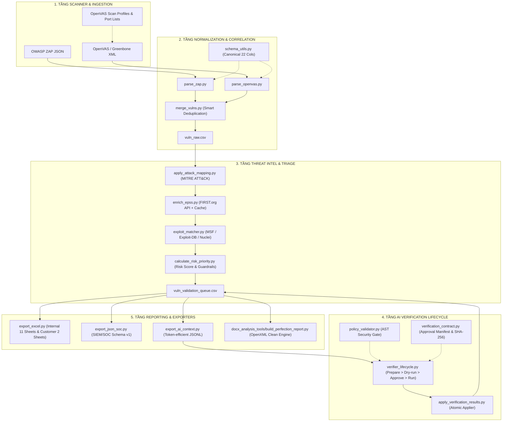

# 🛡️ Vulnerability Assessment & Threat Intelligence Pipeline (VA Pipeline)

> **Lưu ý:** File tài liệu này được đồng bộ trực tiếp với trang chủ dự án tại [README.md](file:///home/dva/Desktop/tool-scan-pipeline-security/README.md).


Hệ thống **Pipeline Tự động hóa Đánh giá Lỗ hổng Bảo mật, Làm giàu Dữ liệu Tình báo Mối đe dọa (Threat Intelligence), Kiểm chứng An toàn bằng AI Agent (Production-Safe Verification)** và **Xuất Báo cáo Đa định dạng (Excel, SOC JSON, Word DOCX Doanh nghiệp)**.

---

## 📑 Mục Lục
- [1. Tổng Quan Kiến Trúc & Luồng Dữ Liệu](#1-tổng-quan-kiến-trúc--luồng-dữ-liệu)
- [2. Các Phân Hệ Tính Năng Cốt Lõi](#2-các-phân-hệ-tính-năng-cốt-lõi)
- [3. Cấu Trúc Thư Mục Dự Án](#3-cấu-trúc-thư-mục-dự-án)
- [4. Yêu Cầu Hệ Thống & Cài Đặt](#4-yêu-cầu-hệ-thống--cài-đặt)
- [5. Hướng Dẫn Vận Hành Pipeline (Quickstart)](#5-hướng-dẫn-vận-hành-pipeline-quickstart)
- [6. Quy Trình Kiểm Chứng An Toàn AI Agent (Verification Lifecycle)](#6-quy-trình-kiểm-chứng-an-toàn-ai-agent-verification-lifecycle)
- [7. Bộ Công Cụ Sinh Báo Cáo DOCX & Kiểm Định 16 Tiêu Chí](#7-bộ-công-cụ-sinh-báo-cáo-docx--kiểm-định-16-tiêu-chí)
- [8. Kiểm Thử Tự Động (Automated Test Suites)](#8-kiểm-thử-tự-động-automated-test-suites)
- [9. Chỉ Mục Tài Liệu Chi Tiết](#9-chỉ-mục-tài-liệu-chi-tiết)

---

## 1. Tổng Quan Kiến Trúc & Luồng Dữ Liệu

Pipeline được thiết kế theo mô hình phân tầng chặt chẽ, tách biệt hoàn toàn giữa dữ liệu quét thô, dữ liệu làm giàu tình báo, kết quả kiểm chứng trên target và dữ liệu báo cáo bàn giao:


```mermaid
flowchart TD
    subgraph S1["1. TẦNG SCANNER & INGESTION"]
        ZAP_RAW["OWASP ZAP JSON"]
        OV_RAW["OpenVAS / Greenbone XML"]
        CONFIGS["OpenVAS Scan Profiles & Port Lists"]
    end

    subgraph S2["2. TẦNG NORMALIZATION & CORRELATION"]
        P_ZAP["parse_zap.py"]
        P_OV["parse_openvas.py"]
        SCHEMA["schema_utils.py (Canonical 22 Cols)"]
        MERGE["merge_vulns.py (Smart Deduplication)"]
        VULN_RAW["vuln_raw.csv"]
    end

    subgraph S3["3. TẦNG THREAT INTEL & TRIAGE"]
        ATTACK["apply_attack_mapping.py (MITRE ATT&CK)"]
        EPSS["enrich_epss.py (FIRST.org API + Cache)"]
        EXPLOIT["exploit_matcher.py (MSF / Exploit-DB / Nuclei)"]
        RISK["calculate_risk_priority.py (Risk Score & Guardrails)"]
        QUEUE["vuln_validation_queue.csv"]
    end

    subgraph S4["4. TẦNG AI VERIFICATION LIFECYCLE"]
        POLICY["policy_validator.py (AST Security Gate)"]
        CONTRACT["verification_contract.py (Approval Manifest & SHA-256)"]
        LIFECYCLE["verifier_lifecycle.py (Prepare > Dry-run > Approve > Run)"]
        APPLIER["apply_verification_results.py (Atomic Applier)"]
    end

    subgraph S5["5. TẦNG REPORTING & EXPORTERS"]
        EXP_EXCEL["export_excel.py (Internal 11 Sheets & Customer 2 Sheets)"]
        EXP_SOC["export_json_soc.py (SIEM/SOC Schema v1)"]
        EXP_AI["export_ai_context.py (Token-efficient JSONL)"]
        DOCX_BUILD["docx_analysis_tools/build_perfection_report.py (OpenXML Clean Engine)"]
    end

    ZAP_RAW --> P_ZAP
    OV_RAW --> P_OV
    CONFIGS -.-> OV_RAW
    SCHEMA -.-> P_ZAP & P_OV
    P_ZAP & P_OV --> MERGE --> VULN_RAW
    VULN_RAW --> ATTACK --> EPSS --> EXPLOIT --> RISK --> QUEUE
    QUEUE --> EXP_AI
    EXP_AI --> LIFECYCLE
    POLICY -.-> LIFECYCLE
    CONTRACT -.-> LIFECYCLE
    LIFECYCLE --> APPLIER --> QUEUE
    QUEUE --> EXP_EXCEL & EXP_SOC & DOCX_BUILD
```

---

## 2. Các Phân Hệ Tính Năng Cốt Lõi

### 2.1. Normalization & Canonical Schema
* **22 Cột Chuẩn Hóa (`CANONICAL_FINDING_COLUMNS`):** Toàn bộ dữ liệu từ các máy quét khác nhau được chuẩn hóa thống nhất, lưu vết đầy đủ ngữ cảnh gốc (`scanner_evidence`, `scanner_solution`, `plugin_id`, `raw_reference`).
* **Parser An Toàn:**
  - [`scripts/parse_openvas.py`](file:///home/dva/Desktop/tool-scan-pipeline-security/scripts/parse_openvas.py): Sử dụng `defusedxml` chống XXE injection; chuẩn hóa CVSS 0.0 sang mức `Informational`.
  - [`scripts/parse_zap.py`](file:///home/dva/Desktop/tool-scan-pipeline-security/scripts/parse_zap.py): Tách 2 tầng dữ liệu: tầng Alert tổng hợp (`zap_findings.csv`) và tầng URL/Payload chi tiết (`zap_instances.csv`).
* **Khử Trùng Lặp Chuẩn Xác ([`scripts/merge_vulns.py`](file:///home/dva/Desktop/tool-scan-pipeline-security/scripts/merge_vulns.py)):** 
  - Gộp thông minh theo 3 tiêu chí độc lập: (1) Trùng ít nhất 1 CVE trên cùng asset & location; (2) Cùng scanner & cùng Plugin ID; (3) Tương đồng tên phát hiện $\ge 80\%$ (`SequenceMatcher.ratio >= 0.8`). 
  - Tuyệt đối không xóa nhầm các lỗ hổng khác nhau chia sẻ chung CWE tổng quát (ví dụ `CWE-200`).

### 2.2. Threat Intelligence & Triage Scoring
* **EPSS Intelligence ([`scripts/enrich_epss.py`](file:///home/dva/Desktop/tool-scan-pipeline-security/scripts/enrich_epss.py)):** Truy vấn batch (tối đa 40 CVE/request) tới FIRST.org API, tự động lưu cache cục bộ tại `.epss_cache.json` và lấy `max(EPSS)` cho phát hiện chứa nhiều CVE.
* **Exploit Matcher Ngữ Cảnh ([`scripts/exploit_matcher.py`](file:///home/dva/Desktop/tool-scan-pipeline-security/scripts/exploit_matcher.py)):** Tra cứu tức thì trong Exploit-DB (SearchSploit với `@lru_cache`), Metasploit Framework Modules và Nuclei Templates. Tự động đối chiếu từ khóa ngữ cảnh (`CONTEXT_KEYWORDS`) để ngăn khớp nhầm phần mềm.
* **MITRE ATT&CK Mapping ([`scripts/apply_attack_mapping.py`](file:///home/dva/Desktop/tool-scan-pipeline-security/scripts/apply_attack_mapping.py)):** Ánh xạ hơn 40 quy tắc từ [`mapping/attack_mapping_rules.yml`](file:///home/dva/Desktop/tool-scan-pipeline-security/mapping/attack_mapping_rules.yml) với điểm tin cậy `confidence` (0.50 – 0.95), gán cờ `needs_review = True` khi độ tin cậy thấp.
* **Công thức Tính Điểm Rủi Ro Hợp Nhất ([`scripts/calculate_risk_priority.py`](file:///home/dva/Desktop/tool-scan-pipeline-security/scripts/calculate_risk_priority.py)):**
  $$\text{Score} = \text{Base Severity (0-80)} + \text{EPSS (+2..+15)} + \text{Exploit (+8..+15)} + \text{Verification (-50..+20)} + \text{Exposure (+5)} + \text{Proof (+10)}$$
  - **Guardrails Chống Thổi Phồng:** Khóa trần rủi ro nghiêm ngặt (Finding `Low` chưa kiểm chứng tối đa 69 điểm; `Medium` tối đa 89 điểm; `FALSE_POSITIVE` tối đa 39 điểm - P4).

### 2.3. Production-Safe AI Verification Lifecycle
* **AST Security Linter ([`scripts/policy_validator.py`](file:///home/dva/Desktop/tool-scan-pipeline-security/scripts/policy_validator.py)):** Quét cây cú pháp trừu tượng Python chặn đứng: `eval`, `exec`, `os.system`, dynamic reflection (`getattr`/`setattr`), dunder attributes (`__subclasses__`), bắt buộc tham số `timeout` và cấm hoàn toàn `shell=True`.
* **Khóa Bất Biến Cryptographic SHA-256:** Quy trình 4 bước (`prepare` $\rightarrow$ `dry-run` $\rightarrow$ `approve` $\rightarrow$ `run`) khóa chặt mã băm SHA-256 của script verifier, scope, context và queue. Nếu bất kỳ file nào bị thay đổi sau khi phê duyệt, lệnh live run lập tức bị hủy.

---

## 3. Cấu Trúc Thư Mục Dự Án

```text
tool-scan-pipeline-security/
├── README.md                                # Trang chủ tài liệu dự án
├── compose.yml                              # Docker stack Greenbone / OpenVAS Community 24.10
├── setup.sh                                 # Script tự động cài đặt toàn bộ hạ tầng & công cụ OS
├── requirements.txt                         # Thư viện Python phụ thuộc
│
├── config/
│   └── scope.example.yml                    # Template cấu hình phạm vi quét (hosts, ports, rate limits)
│
├── mapping/
│   └── attack_mapping_rules.yml             # 40+ quy tắc ánh xạ kỹ thuật MITRE ATT&CK
│
├── scripts/                                 # Cụm Scripts Xử lý Trung tâm của Pipeline
│   ├── run_pipeline.py                      # Orchestrator chính điều khiển toàn bộ pipeline
│   ├── runtime_context.py                   # Quản lý đường dẫn động theo từng run (VA_RUN_DIR)
│   ├── schema_utils.py                      # Định nghĩa 22 cột Canonical Schema & Redaction engine
│   ├── parse_openvas.py                     # Parser XML OpenVAS an toàn chống XXE
│   ├── parse_zap.py                         # Parser JSON OWASP ZAP phân rã 2 tầng
│   ├── merge_vulns.py                       # Engine khử trùng lặp và hợp nhất kết quả
│   ├── apply_attack_mapping.py              # Rule engine gán nhãn MITRE ATT&CK
│   ├── enrich_epss.py                       # Client tra cứu FIRST.org EPSS + Local Cache
│   ├── exploit_matcher.py                   # Tra cứu Metasploit, Exploit-DB, Nuclei templates
│   ├── calculate_risk_priority.py           # Tính toán Risk Score 0-100 & Guardrails
│   ├── policy_validator.py                  # Bộ kiểm định tĩnh AST an toàn cho code AI
│   ├── verification_contract.py             # Hợp đồng kiểm chứng, chặn loopback & metadata IP
│   ├── verifier_lifecycle.py                # State machine kiểm soát vòng đời 4 bước của Verifier
│   ├── apply_verification_results.py        # Nạp kết quả kiểm chứng nguyên tử vào CSV
│   ├── export_excel.py                      # Xuất Excel nội bộ (11 sheets) & khách hàng (2 sheets)
│   ├── export_json_soc.py                   # Xuất sự kiện chuẩn SOC/SIEM Schema v1
│   ├── export_ai_context.py                 # Xuất JSONL tối ưu token cho AI Agent
│   ├── verify_setup.py                      # Kiểm tra tính sẵn sàng của công cụ và môi trường
│   └── test_portability.py                  # Kiểm tra tính di động và liên kết thư mục
│
├── docx_analysis_tools/                     # Bộ Công Cụ Sinh Báo Cáo Word DOCX Hoàn Hảo
│   ├── README.md                            # Hướng dẫn chi tiết kỹ thuật OpenXML DOCX
│   ├── analyze_docx_template.py             # Giải phẫu cấu trúc file mẫu DOCX
│   ├── persist_knowledge_base.py            # Bền vững hóa kho tri thức lỗ hổng ra JSON
│   ├── build_perfection_report.py           # CANONICAL BUILDER: Khởi tạo báo cáo DOCX hoàn hảo
│   ├── validate_report_perfection.py        # Bộ kiểm định tự động 16 tiêu chí (16 Assertions)
│   ├── full_vulnerability_knowledge_base.json # Kho tri thức 35+ lỗ hổng đã Việt hóa
│   ├── archive/                             # Lưu trữ lịch sử các phiên bản build cũ (v2..v6)
│   └── debug_utils/                         # Lưu trữ các script inspect và gỡ lỗi OpenXML
│
├── OpenVas-config/                          # Cấu hình Quét OpenVAS / Greenbone
│   ├── scan-configs/                        # 4 Profile XML: Applications, Network, Security, Servers
│   └── port-lists/                          # 5 Port Lists XML & Range chuẩn hóa
│
├── docs/                                    # Tài liệu Vận hành & Mô hình Bảo mật Chi tiết
│   ├── README.md                            # Bản sao lưu tài liệu
│   ├── SECURITY_MODEL.md                    # Mô hình ranh giới an toàn trên Production
│   ├── OPERATIONS.md                        # Sổ tay vận hành chuẩn (Runbook)
│   ├── VERIFY.md                            # Nguyên tắc viết script kiểm chứng an toàn
│   └── RUN_LOG_TEMPLATE.md                  # Mẫu nhật ký bàn giao ca trực
│
├── tests/                                   # Bộ Kiểm Thử Tự Động (Regression Test Suite)
│   ├── test_pipeline_regression.py          # 22 bài test hồi quy logic pipeline
│   └── test_openvas_configs.py              # 6 bài test tính toàn vẹn cấu hình Greenbone XML
│
└── runs/                                    # Thư mục chứa Artifact theo từng lần chạy (run_YYYYMMDD_HHMMSS)
```

---

## 4. Yêu Cầu Hệ Thống & Cài Đặt

### 4.1. Yêu cầu phần cứng & hệ điều hành
* **Hệ điều hành:** Linux (Khuyến nghị Ubuntu 22.04 LTS / 24.04 LTS).
* **RAM:** Tối thiểu 8 GB (Khuyến nghị 16 GB nếu chạy trọn bộ Greenbone Docker stack).
* **Python:** 3.10 trở lên.
* **Docker & Docker Compose:** Đã cài đặt và user hiện tại có quyền chạy Docker không cần `sudo`.

### 4.2. Cài đặt tự động trong 1 bước
Chạy script cài đặt toàn diện:
```bash
chmod +x setup.sh
./setup.sh
```

### 4.3. Kiểm tra tính sẵn sàng của môi trường
Sau khi cài đặt xong, chạy script kiểm định môi trường:
```bash
./venv/bin/python3 scripts/verify_setup.py
./venv/bin/python3 scripts/test_portability.py
```
*(Nếu toàn bộ các mục hiển thị xanh ✅, môi trường đã sẵn sàng 100%).*

---

## 5. Hướng Dẫn Vận Hành Pipeline (Quickstart)

### 5.1. Khởi chạy Giao diện Tương tác Menu
```bash
./venv/bin/python3 scripts/run_pipeline.py
```
Menu tương tác sẽ hiển thị:
```text
1. Start Scan        (Quét trực tiếp mục tiêu với OpenVAS & OWASP ZAP)
2. Process Only      (Xử lý lại dữ liệu từ kết quả quét thô có sẵn)
3. Exit
```

### 5.2. Chế độ CLI Không Tương tác (Non-interactive)
Chạy xử lý pipeline từ file scan có sẵn:
```bash
./venv/bin/python3 scripts/run_pipeline.py \
  --non-interactive \
  --openvas-xml /path/to/openvas_report.xml \
  --zap-json /path/to/zap_report.json \
  --output-dir runs/run_custom
```

### 5.3. Xem Thống Kê Nhanh (Stats Only)
```bash
./venv/bin/python3 scripts/show_stats.py
```

---

## 6. Quy Trình Kiểm Chứng An Toàn AI Agent (Verification Lifecycle)

Khi kích hoạt AI Agent hỗ trợ kiểm chứng lỗ hổng, quy trình được bảo vệ nghiêm ngặt qua 4 bước của [`verifier_lifecycle.py`](file:///home/dva/Desktop/tool-scan-pipeline-security/scripts/verifier_lifecycle.py):

```bash
# Bước 1: Chuẩn bị môi trường & xuất ngữ cảnh AI an toàn
./venv/bin/python3 scripts/verifier_lifecycle.py prepare https://target.example

# Bước 2: Chạy thử nghiệm Dry-run & khóa mã băm SHA-256 vào approval_manifest.json
./venv/bin/python3 scripts/verifier_lifecycle.py dry-run https://target.example

# Bước 3: Người vận hành review & ký duyệt manifest
./venv/bin/python3 scripts/verifier_lifecycle.py approve https://target.example --operator analyst_name

# Bước 4: Thực thi kiểm chứng an toàn (Chỉ ghi kết quả ra verification_results.jsonl)
./venv/bin/python3 scripts/verifier_lifecycle.py run https://target.example

# Bước 5: Nạp kết quả kiểm chứng vào Queue dữ liệu chính
./venv/bin/python3 scripts/apply_verification_results.py
```

---

## 7. Bộ Công Cụ Sinh Báo Cáo DOCX & Kiểm Định 16 Tiêu Chí

Dự án tích hợp bộ sinh báo cáo Word cao cấp đạt chuẩn doanh nghiệp tại [`docx_analysis_tools/`](file:///home/dva/Desktop/tool-scan-pipeline-security/docx_analysis_tools):

```bash
# 1. Sinh báo cáo Word DOCX hoàn mỹ (Tự động kèm biểu đồ & kho tri thức tiếng Việt)
./venv/bin/python3 docx_analysis_tools/build_perfection_report.py

# 2. Chạy bộ kiểm định tự động 16 tiêu chí (16 Assertions)
./venv/bin/python3 docx_analysis_tools/validate_report_perfection.py Bao_Cao_An_Toan_Thong_Tin_2026.docx
```

### 16 Tiêu chí Kiểm định Tự động:
1. **0 Thẻ ẩn SDT:** Xóa sạch 100% thẻ cache mục lục cũ trong `w:body`.
2. **0 Nhãn Severity tiếng Anh:** 100% chuyển hóa thành `NGHIÊM TRỌNG`, `CAO`, `TRUNG BÌNH`, `THẤP`.
3. **0 Tin báo Informational:** Lọc sạch các tin báo mức thông tin khỏi tài liệu chính.
4. **0 Rò rỉ mã HTML thô:** Bóc tách sạch các thẻ `<p>`, `<br>`, `<b>`.
5. **0 Nhãn Placeholder/Mock:** Không rò rỉ các chuỗi `(Mock)` hoặc `(Thực tế)`.
6. **100% Font Times New Roman:** Ép font đồng nhất ở mức thẻ XML `w:rFonts`.
7. **Khung Bằng chứng Callout Box:** Bằng chứng được đóng khung bảng 1x1, tô nền `#F9F9F9`.
8. **Đúng 2 Biểu đồ Phân bổ:** Biểu đồ Laptop đặt tại Mục 2.1, Web Server tại Mục 2.2.
9. **Chống Vỡ Ô Qua Trang (`w:cantSplit`):** 100% hàng bảng không bị xé đôi khi sang trang mới.
10. **Chống Tiêu đề Mồ côi (`keep_with_next`):** 100% Heading 1-3 gắn liền với nội dung bên dưới.
11. **Lặp lại Tiêu đề Bảng (`w:tblHeader`):** Tự động lặp tiêu đề cho các bảng dữ liệu nhiều trang.
12. **Mục lục Kép (Dual TOC):** Kết hợp Bảng phân cấp trực quan và Native Word Field Code.
13. **Việt hóa Màu sắc Chuẩn:** Đỏ rực `#FF0000`, Đỏ đậm `#C00000`, Cam `#ED7D31`, Xanh `#4472C4`.
14. **Giãn dòng Chuẩn Văn Bản:** Paragraph space after & line spacing chuẩn mực văn bản hành chính.
15. **Căn giữa Toàn bộ Bảng:** `WD_TABLE_ALIGNMENT.CENTER` đồng trục lề in trang.
16. **Đầy đủ 8 Mục Nội dung Bắt buộc.**

---

## 8. Kiểm Thử Tự Động (Automated Test Suites)

Hệ thống đi kèm bộ kiểm thử hồi quy 28 test cases độc lập:

```bash
# Chạy toàn bộ 28 bài kiểm tra tự động
./venv/bin/python3 -m unittest discover tests -v
```

### Chi tiết Test Coverage:
* **`tests/test_pipeline_regression.py` (22 tests):** Kiểm tra logic deduplication không drop CWE, parse severity Informational, trích xuất đa CVE, tính toán Risk Score & Guardrails, linter AST policy validator, phát hiện loopback/metadata IP, sinh báo cáo Excel 11 sheets và SOC JSON.
* **`tests/test_openvas_configs.py` (6 tests):** Kiểm tra 4 cấu hình Greenbone XML, 5 danh sách port lists, đảm bảo 0 hardcoded credentials và loại bỏ 100% các plugin gây DoS/Brute-force.

---

## 9. Chỉ Mục Tài Liệu Chi Tiết

* 📖 **[Mô Hình An Toàn Production (`docs/SECURITY_MODEL.md`)](file:///home/dva/Desktop/tool-scan-pipeline-security/docs/SECURITY_MODEL.md):** Ranh giới an toàn và nguyên tắc bất di bất dịch khi quét hệ thống thật.
* 📋 **[Sổ Tay Vận Hành Chuẩn (`docs/OPERATIONS.md`)](file:///home/dva/Desktop/tool-scan-pipeline-security/docs/OPERATIONS.md):** Hướng dẫn vận hành theo ca trực, quản lý `VA_RUN_DIR` và checkpoint phê duyệt.
* 🛡️ **[Quy Chuẩn Viết Script Kiểm Chứng (`docs/VERIFY.md`)](file:///home/dva/Desktop/tool-scan-pipeline-security/docs/VERIFY.md):** Tiêu chuẩn lập trình an toàn cho AI Verifier.
* 📑 **[Tài Liệu Kỹ Thuật DOCX OpenXML (`docx_analysis_tools/README.md`)](file:///home/dva/Desktop/tool-scan-pipeline-security/docx_analysis_tools/README.md):** Giải phẫu chi tiết cấu trúc OpenXML và quy trình sinh báo cáo.
* 🤖 **[Tài Liệu Skill AI Agent (`.agents/skills/docx-skill/README.md`)](file:///home/dva/Desktop/tool-scan-pipeline-security/.agents/skills/docx-skill/README.md):** Hướng dẫn tích hợp Skill cho Gemini / Antigravity Agent.
